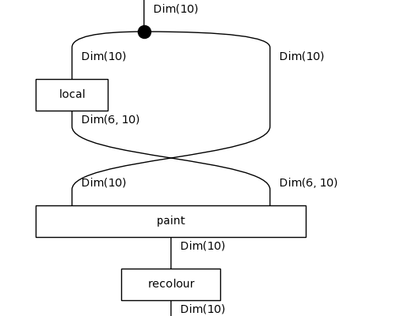
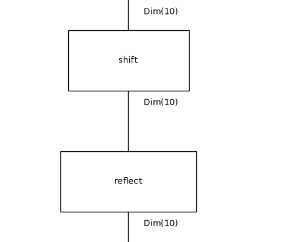

# Diagrammatic DreamCoder on 1D-ARC: results

Tasks: 180 (10 per family, drawn with seed 0), fitted on their 3 training pairs only, scored on the held-out test pair by exact match. Config: `results/control-size4/config.json`.

## Per iteration

| iteration | top-1 test | top-3 test | train fit exactly | mean DL (bits) | library | candidates | wall-clock |
|---|---|---|---|---|---|---|---|
| 0 | 102/180 (57%) | 133/180 | 114/180 | 78.3 | 7 | 80 | 875s |

Top-1 is the prediction of the least-DL candidate; top-3 counts a hit among the three kept. Mean DL is over the best candidate of every task.

## Per family (top-1 test exact match)

| family | it 0 |
|---|---|
| denoising_1c | 7/10 |
| denoising_mc | 1/10 |
| fill | 7/10 |
| flip | 0/10 |
| hollow | 9/10 |
| mirror | 1/10 |
| move_1p | 9/10 |
| move_2p | 10/10 |
| move_2p_dp | 1/10 |
| move_3p | 10/10 |
| move_dp | 0/10 |
| padded_fill | 9/10 |
| pcopy_1c | 2/10 |
| pcopy_mc | 4/10 |
| recolor_cmp | 10/10 |
| recolor_cnt | 6/10 |
| recolor_oe | 9/10 |
| scale_dp | 7/10 |

## Library growth

- no fragment had support in two tasks

## Examples from the last iteration

### Solved: `1d_move_3p_32`

`shift(x)`, DL 53.4 = 4.0 structure + 43.1 parameters + 6.2 data bits, fits its training pairs exactly.

| pair | input | output |
|---|---|---|
| train 0 | `....666.......................` | `.......666....................` |
| train 1 | `88888888888888888888888888....` | `...88888888888888888888888888.` |
| train 2 | `..2222222222222222222.........` | `.....2222222222222222222......` |
| **test** | `222222222222222222222222......` | `...222222222222222222222222...` |
| predicted | | `...222222222222222222222222...` |

### Solved: `1d_move_3p_42`

`shift(x)`, DL 53.6 = 4.0 structure + 43.1 parameters + 6.6 data bits, fits its training pairs exactly.

| pair | input | output |
|---|---|---|
| train 0 | `22222222222222222222222....` | `...22222222222222222222222.` |
| train 1 | `..............7777.........` | `.................7777......` |
| train 2 | `..111111111111.............` | `.....111111111111..........` |
| **test** | `..22222222.................` | `.....22222222..............` |
| predicted | | `.....22222222..............` |

### Solved: `1d_scale_dp_24`

`recolour(paint(x, local(x)))`, DL 61.2 = 9.6 structure + 51.4 parameters + 0.2 data bits, fits its training pairs exactly.

| pair | input | output |
|---|---|---|
| train 0 | `......222222222222..9.....` | `......222222222222229.....` |
| train 1 | `..777777777777777777...9..` | `..7777777777777777777779..` |
| train 2 | `..5555555555555555..9.....` | `..5555555555555555559.....` |
| **test** | `......77777777777777...9..` | `......777777777777777779..` |
| predicted | | `......777777777777777779..` |

### Failed: `1d_denoising_mc_21`

`shift(x)`, DL 60.8 = 4.0 structure + 38.7 parameters + 18.1 data bits, does not fit its training pairs exactly.

| pair | input | output |
|---|---|---|
| train 0 | `...555555555355555555555........` | `...555555555555555555555........` |
| train 1 | `........222222222222222129222...` | `........222222222222222222222...` |
| train 2 | `4444444462444444644444..........` | `4444444444444444444444..........` |
| **test** | `99993999993999999999999.........` | `99999999999999999999999.........` |
| predicted | | `99993999993999999999999.........` |

### Failed: `1d_mirror_45`

`reflect(shift(x))`, DL 75.8 = 7.0 structure + 48.9 parameters + 19.9 data bits, does not fit its training pairs exactly.

| pair | input | output |
|---|---|---|
| train 0 | `...111.9.....` | `.......9.111.` |
| train 1 | `...444.9.....` | `.......9.444.` |
| train 2 | `.111.9.......` | `.....9.111...` |
| **test** | `777.9........` | `....9.777....` |
| predicted | | `..........9.7` |

### Failed: `1d_pcopy_mc_27`

`shift(x)`, DL 75.5 = 4.0 structure + 47.1 parameters + 24.5 data bits, does not fit its training pairs exactly.

| pair | input | output |
|---|---|---|
| train 0 | `..888...1........................` | `..888..111.......................` |
| train 1 | `.888...7.........................` | `.888..777........................` |
| train 2 | `.222....3........................` | `.222...333.......................` |
| **test** | `.555....2........................` | `.555...222.......................` |
| predicted | | `.555.............................` |

## All best solutions, last iteration

| task | term | DL | test |
|---|---|---|---|
| 1d_denoising_1c_16 | `shift(x)` | 70.7 | ✗ |
| 1d_denoising_1c_22 | `paint(x, local(x))` | 55.4 | ✓ |
| 1d_denoising_1c_25 | `paint(paint(x, scan(x)), local(x))` | 70.3 | ✓ |
| 1d_denoising_1c_27 | `paint(recolour(shift(x)), local(x))` | 63.2 | ✓ |
| 1d_denoising_1c_31 | `paint(recolour(shift(x)), scan(x))` | 48.2 | ✗ |
| 1d_denoising_1c_37 | `paint(x, local(x))` | 55.0 | ✓ |
| 1d_denoising_1c_39 | `paint(x, local(x))` | 55.4 | ✓ |
| 1d_denoising_1c_44 | `paint(x, local(paint(x, scan(x))))` | 63.0 | ✓ |
| 1d_denoising_1c_48 | `paint(paint(x, scan(x)), local(x))` | 69.8 | ✓ |
| 1d_denoising_1c_49 | `shift(x)` | 68.8 | ✗ |
| 1d_denoising_mc_0 | `shift(x)` | 58.3 | ✗ |
| 1d_denoising_mc_11 | `shift(x)` | 61.1 | ✗ |
| 1d_denoising_mc_15 | `paint(shift(x), local(x))` | 60.5 | ✓ |
| 1d_denoising_mc_21 | `shift(x)` | 60.8 | ✗ |
| 1d_denoising_mc_25 | `shift(x)` | 62.2 | ✗ |
| 1d_denoising_mc_30 | `shift(x)` | 64.7 | ✗ |
| 1d_denoising_mc_36 | `shift(x)` | 72.7 | ✗ |
| 1d_denoising_mc_44 | `shift(x)` | 58.6 | ✗ |
| 1d_denoising_mc_5 | `shift(x)` | 57.6 | ✗ |
| 1d_denoising_mc_6 | `shift(x)` | 54.8 | ✗ |
| 1d_fill_10 | `recolour(paint(x, scan(x)))` | 46.1 | ✓ |
| 1d_fill_14 | `paint(paint(x, scan(x)), local(x))` | 109.9 | ✓ |
| 1d_fill_19 | `shift(x)` | 68.0 | ✗ |
| 1d_fill_28 | `paint(paint(x, scan(x)), segment(x))` | 45.6 | ✓ |
| 1d_fill_30 | `paint(paint(x, scan(x)), local(x))` | 105.4 | ✓ |
| 1d_fill_32 | `paint(paint(x, scan(x)), local(x))` | 101.5 | ✓ |
| 1d_fill_42 | `shift(x)` | 73.4 | ✗ |
| 1d_fill_46 | `shift(shift(x))` | 99.6 | ✗ |
| 1d_fill_49 | `paint(paint(x, scan(x)), segment(x))` | 43.1 | ✓ |
| 1d_fill_9 | `paint(paint(x, scan(x)), local(x))` | 56.5 | ✓ |
| 1d_flip_1 | `paint(recolour(shift(x)), local(x))` | 108.0 | ✗ |
| 1d_flip_12 | `paint(paint(x, local(x)), local(x))` | 107.2 | ✗ |
| 1d_flip_13 | `paint(recolour(x), scan(x))` | 107.9 | ✗ |
| 1d_flip_2 | `paint(shift(x), local(x))` | 90.1 | ✗ |
| 1d_flip_27 | `paint(shift(x), scan(x))` | 105.3 | ✗ |
| 1d_flip_28 | `paint(x, segment(x))` | 120.9 | ✗ |
| 1d_flip_36 | `paint(paint(x, scan(x)), scan(x))` | 94.0 | ✗ |
| 1d_flip_38 | `paint(paint(x, local(x)), segment(x))` | 114.9 | ✗ |
| 1d_flip_40 | `shift(x)` | 120.1 | ✗ |
| 1d_flip_42 | `paint(shift(x), scan(x))` | 109.3 | ✗ |
| 1d_hollow_0 | `paint(paint(x, scan(x)), segment(x))` | 73.3 | ✓ |
| 1d_hollow_10 | `recolour(paint(x, segment(x)))` | 62.4 | ✓ |
| 1d_hollow_17 | `paint(paint(x, scan(x)), segment(x))` | 63.8 | ✓ |
| 1d_hollow_23 | `paint(paint(x, scan(x)), segment(x))` | 78.7 | ✓ |
| 1d_hollow_24 | `recolour(paint(x, segment(x)))` | 84.9 | ✓ |
| 1d_hollow_30 | `recolour(paint(x, segment(x)))` | 53.8 | ✓ |
| 1d_hollow_33 | `paint(x, scan(reflect(x)))` | 82.3 | ✗ |
| 1d_hollow_39 | `recolour(paint(x, segment(x)))` | 95.0 | ✓ |
| 1d_hollow_40 | `paint(paint(x, local(x)), segment(x))` | 74.9 | ✓ |
| 1d_hollow_43 | `paint(paint(x, scan(x)), segment(x))` | 63.4 | ✓ |
| 1d_mirror_1 | `reflect(shift(x))` | 82.3 | ✗ |
| 1d_mirror_13 | `paint(x, segment(x))` | 184.6 | ✗ |
| 1d_mirror_14 | `shift(reflect(shift(x)))` | 113.9 | ✗ |
| 1d_mirror_23 | `reflect(shift(shift(x)))` | 112.9 | ✗ |
| 1d_mirror_27 | `shift(reflect(shift(x)))` | 148.1 | ✗ |
| 1d_mirror_28 | `shift(reflect(x))` | 82.4 | ✓ |
| 1d_mirror_37 | `reflect(shift(x))` | 82.3 | ✗ |
| 1d_mirror_42 | `shift(reflect(shift(x)))` | 150.4 | ✗ |
| 1d_mirror_45 | `reflect(shift(x))` | 75.8 | ✗ |
| 1d_mirror_47 | `paint(paint(x, scan(x)), segment(x))` | 128.7 | ✗ |
| 1d_move_1p_10 | `shift(x)` | 52.5 | ✓ |
| 1d_move_1p_12 | `shift(x)` | 53.0 | ✓ |
| 1d_move_1p_16 | `shift(x)` | 53.2 | ✓ |
| 1d_move_1p_18 | `paint(shift(x), local(x))` | 52.2 | ✗ |
| 1d_move_1p_19 | `shift(x)` | 54.8 | ✓ |
| 1d_move_1p_3 | `shift(x)` | 52.4 | ✓ |
| 1d_move_1p_35 | `shift(x)` | 52.1 | ✓ |
| 1d_move_1p_36 | `shift(x)` | 54.4 | ✓ |
| 1d_move_1p_49 | `shift(x)` | 52.4 | ✓ |
| 1d_move_1p_8 | `shift(x)` | 54.8 | ✓ |
| 1d_move_2p_16 | `shift(x)` | 47.5 | ✓ |
| 1d_move_2p_25 | `shift(x)` | 48.2 | ✓ |
| 1d_move_2p_32 | `shift(x)` | 48.1 | ✓ |
| 1d_move_2p_36 | `shift(x)` | 48.0 | ✓ |
| 1d_move_2p_40 | `shift(x)` | 48.7 | ✓ |
| 1d_move_2p_41 | `shift(x)` | 47.6 | ✓ |
| 1d_move_2p_44 | `shift(x)` | 54.1 | ✓ |
| 1d_move_2p_45 | `shift(x)` | 47.9 | ✓ |
| 1d_move_2p_47 | `shift(x)` | 47.6 | ✓ |
| 1d_move_2p_5 | `shift(x)` | 45.9 | ✓ |
| 1d_move_2p_dp_1 | `shift(x)` | 68.4 | ✗ |
| 1d_move_2p_dp_11 | `paint(paint(x, local(x)), scan(x))` | 65.8 | ✓ |
| 1d_move_2p_dp_18 | `shift(x)` | 66.4 | ✗ |
| 1d_move_2p_dp_21 | `shift(x)` | 66.9 | ✗ |
| 1d_move_2p_dp_30 | `shift(x)` | 65.3 | ✗ |
| 1d_move_2p_dp_38 | `shift(x)` | 66.3 | ✗ |
| 1d_move_2p_dp_42 | `shift(x)` | 68.1 | ✗ |
| 1d_move_2p_dp_47 | `shift(x)` | 67.0 | ✗ |
| 1d_move_2p_dp_48 | `shift(x)` | 69.9 | ✗ |
| 1d_move_2p_dp_7 | `shift(x)` | 59.4 | ✗ |
| 1d_move_3p_17 | `shift(x)` | 53.6 | ✓ |
| 1d_move_3p_18 | `shift(x)` | 53.9 | ✓ |
| 1d_move_3p_2 | `shift(x)` | 54.3 | ✓ |
| 1d_move_3p_31 | `shift(x)` | 53.9 | ✓ |
| 1d_move_3p_32 | `shift(x)` | 53.4 | ✓ |
| 1d_move_3p_33 | `shift(x)` | 53.6 | ✓ |
| 1d_move_3p_34 | `shift(x)` | 52.8 | ✓ |
| 1d_move_3p_37 | `paint(paint(x, local(x)), segment(x))` | 51.9 | ✓ |
| 1d_move_3p_42 | `shift(x)` | 53.6 | ✓ |
| 1d_move_3p_9 | `shift(x)` | 54.4 | ✓ |
| 1d_move_dp_1 | `shift(shift(x))` | 127.6 | ✗ |
| 1d_move_dp_13 | `recolour(paint(x, local(x)))` | 151.9 | ✗ |
| 1d_move_dp_18 | `shift(x)` | 105.4 | ✗ |
| 1d_move_dp_2 | `paint(paint(x, scan(x)), local(x))` | 179.2 | ✗ |
| 1d_move_dp_28 | `paint(paint(x, local(x)), scan(x))` | 112.5 | ✗ |
| 1d_move_dp_38 | `paint(x, scan(shift(x)))` | 154.7 | ✗ |
| 1d_move_dp_44 | `shift(x)` | 62.2 | ✗ |
| 1d_move_dp_49 | `paint(x, local(reflect(x)))` | 126.3 | ✗ |
| 1d_move_dp_5 | `shift(shift(x))` | 155.3 | ✗ |
| 1d_move_dp_8 | `paint(paint(x, local(x)), local(x))` | 58.5 | ✗ |
| 1d_padded_fill_18 | `paint(paint(x, scan(x)), segment(x))` | 58.0 | ✓ |
| 1d_padded_fill_22 | `recolour(paint(x, scan(x)))` | 81.4 | ✓ |
| 1d_padded_fill_23 | `paint(paint(x, scan(x)), segment(x))` | 47.0 | ✓ |
| 1d_padded_fill_27 | `recolour(paint(x, scan(x)))` | 99.3 | ✗ |
| 1d_padded_fill_32 | `paint(paint(x, scan(x)), segment(x))` | 55.7 | ✓ |
| 1d_padded_fill_40 | `paint(paint(x, scan(x)), segment(x))` | 60.9 | ✓ |
| 1d_padded_fill_42 | `paint(paint(x, scan(x)), segment(x))` | 64.5 | ✓ |
| 1d_padded_fill_6 | `paint(paint(x, scan(x)), local(x))` | 69.3 | ✓ |
| 1d_padded_fill_8 | `paint(paint(x, scan(x)), segment(x))` | 53.4 | ✓ |
| 1d_padded_fill_9 | `recolour(paint(x, scan(x)))` | 50.4 | ✓ |
| 1d_pcopy_1c_0 | `shift(x)` | 85.6 | ✗ |
| 1d_pcopy_1c_18 | `shift(x)` | 91.7 | ✗ |
| 1d_pcopy_1c_2 | `paint(paint(x, scan(x)), local(x))` | 82.1 | ✓ |
| 1d_pcopy_1c_21 | `shift(x)` | 92.3 | ✗ |
| 1d_pcopy_1c_22 | `shift(x)` | 92.8 | ✗ |
| 1d_pcopy_1c_24 | `shift(x)` | 91.6 | ✗ |
| 1d_pcopy_1c_32 | `shift(x)` | 92.1 | ✗ |
| 1d_pcopy_1c_36 | `paint(paint(x, local(x)), local(x))` | 91.1 | ✓ |
| 1d_pcopy_1c_4 | `paint(paint(x, local(x)), segment(x))` | 77.0 | ✗ |
| 1d_pcopy_1c_49 | `shift(x)` | 91.7 | ✗ |
| 1d_pcopy_mc_12 | `paint(paint(x, scan(x)), local(x))` | 91.1 | ✓ |
| 1d_pcopy_mc_21 | `paint(shift(x), local(x))` | 82.7 | ✓ |
| 1d_pcopy_mc_24 | `shift(x)` | 86.7 | ✗ |
| 1d_pcopy_mc_26 | `paint(paint(x, scan(x)), local(x))` | 95.2 | ✓ |
| 1d_pcopy_mc_27 | `shift(x)` | 75.5 | ✗ |
| 1d_pcopy_mc_30 | `shift(x)` | 93.1 | ✗ |
| 1d_pcopy_mc_32 | `shift(x)` | 86.9 | ✗ |
| 1d_pcopy_mc_33 | `paint(paint(x, scan(x)), local(x))` | 80.3 | ✓ |
| 1d_pcopy_mc_36 | `shift(x)` | 75.6 | ✗ |
| 1d_pcopy_mc_49 | `shift(x)` | 92.9 | ✗ |
| 1d_recolor_cmp_10 | `paint(paint(x, segment(x)), local(x))` | 53.5 | ✓ |
| 1d_recolor_cmp_11 | `recolour(paint(x, segment(x)))` | 54.8 | ✓ |
| 1d_recolor_cmp_18 | `recolour(paint(x, segment(x)))` | 70.6 | ✓ |
| 1d_recolor_cmp_3 | `recolour(paint(x, segment(x)))` | 69.3 | ✓ |
| 1d_recolor_cmp_34 | `recolour(paint(x, segment(x)))` | 53.5 | ✓ |
| 1d_recolor_cmp_36 | `recolour(paint(x, segment(x)))` | 67.4 | ✓ |
| 1d_recolor_cmp_39 | `recolour(paint(x, segment(x)))` | 67.4 | ✓ |
| 1d_recolor_cmp_46 | `recolour(paint(x, segment(x)))` | 55.0 | ✓ |
| 1d_recolor_cmp_8 | `recolour(paint(x, segment(x)))` | 54.4 | ✓ |
| 1d_recolor_cmp_9 | `recolour(paint(x, segment(x)))` | 54.6 | ✓ |
| 1d_recolor_cnt_1 | `paint(paint(x, local(x)), segment(x))` | 113.3 | ✓ |
| 1d_recolor_cnt_15 | `recolour(paint(x, scan(x)))` | 115.5 | ✗ |
| 1d_recolor_cnt_21 | `paint(shift(x), segment(x))` | 105.5 | ✓ |
| 1d_recolor_cnt_28 | `paint(paint(x, scan(x)), segment(x))` | 128.8 | ✓ |
| 1d_recolor_cnt_38 | `paint(paint(x, segment(x)), local(x))` | 120.8 | ✓ |
| 1d_recolor_cnt_4 | `paint(paint(x, local(x)), segment(x))` | 113.7 | ✓ |
| 1d_recolor_cnt_45 | `recolour(paint(x, scan(x)))` | 119.3 | ✗ |
| 1d_recolor_cnt_46 | `paint(paint(x, segment(x)), segment(x))` | 130.2 | ✓ |
| 1d_recolor_cnt_48 | `paint(shift(x), segment(x))` | 120.4 | ✗ |
| 1d_recolor_cnt_9 | `recolour(paint(x, scan(x)))` | 107.7 | ✗ |
| 1d_recolor_oe_12 | `paint(paint(x, segment(x)), segment(x))` | 92.2 | ✓ |
| 1d_recolor_oe_14 | `paint(paint(x, segment(x)), segment(x))` | 110.3 | ✓ |
| 1d_recolor_oe_17 | `paint(recolour(x), segment(x))` | 98.1 | ✓ |
| 1d_recolor_oe_19 | `paint(x, scan(x))` | 97.4 | ✗ |
| 1d_recolor_oe_25 | `paint(paint(x, segment(x)), segment(x))` | 97.1 | ✓ |
| 1d_recolor_oe_27 | `paint(paint(x, scan(x)), segment(x))` | 76.4 | ✓ |
| 1d_recolor_oe_32 | `recolour(paint(x, segment(x)))` | 80.8 | ✓ |
| 1d_recolor_oe_35 | `recolour(paint(x, segment(x)))` | 78.4 | ✓ |
| 1d_recolor_oe_43 | `paint(paint(x, segment(x)), segment(x))` | 109.2 | ✓ |
| 1d_recolor_oe_46 | `paint(paint(x, local(x)), segment(x))` | 116.2 | ✓ |
| 1d_scale_dp_10 | `paint(paint(x, scan(x)), local(x))` | 74.7 | ✓ |
| 1d_scale_dp_15 | `paint(paint(x, scan(x)), local(x))` | 52.8 | ✓ |
| 1d_scale_dp_20 | `recolour(paint(x, local(x)))` | 47.7 | ✗ |
| 1d_scale_dp_24 | `recolour(paint(x, local(x)))` | 61.2 | ✓ |
| 1d_scale_dp_27 | `paint(paint(x, scan(x)), local(x))` | 48.8 | ✓ |
| 1d_scale_dp_3 | `paint(paint(x, scan(x)), local(x))` | 48.6 | ✓ |
| 1d_scale_dp_34 | `recolour(paint(x, local(x)))` | 62.9 | ✗ |
| 1d_scale_dp_36 | `shift(x)` | 66.2 | ✗ |
| 1d_scale_dp_49 | `recolour(paint(x, scan(x)))` | 57.1 | ✓ |
| 1d_scale_dp_5 | `paint(paint(x, local(x)), scan(x))` | 63.0 | ✓ |
