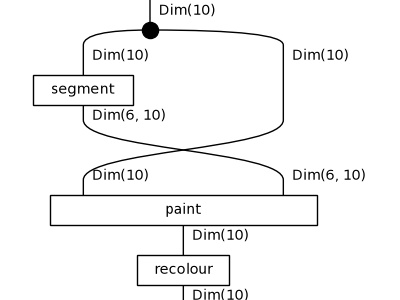
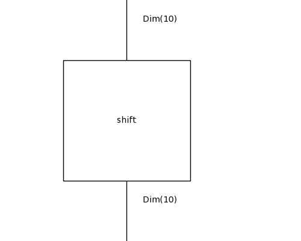
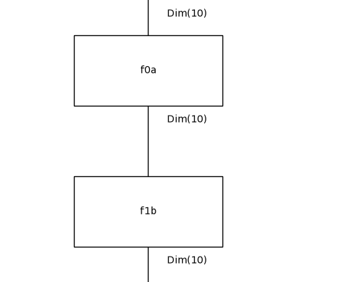

# Diagrammatic DreamCoder on 1D-ARC: results

Tasks: 180 (10 per family, drawn with seed 0), fitted on their 3 training pairs only, scored on the held-out test pair by exact match. Config: `/results/default-cpu4/config.json`.

## Per iteration

| iteration | top-1 test | top-3 test | train fit exactly | mean DL (bits) | library | candidates | wall-clock |
|---|---|---|---|---|---|---|---|
| 0 | 76/180 (42%) | 115/180 | 91/180 | 85.0 | 7 | 57 | 422s |
| 1 | 88/180 (49%) | 130/180 | 105/180 | 79.0 | 9 | 80 | 948s |
| 2 | 98/180 (54%) | 137/180 | 117/180 | 77.9 | 11 | 80 | 1000s |

Top-1 is the prediction of the least-DL candidate; top-3 counts a hit among the three kept. Mean DL is over the best candidate of every task.

## Per family (top-1 test exact match)

| family | it 0 | it 1 | it 2 |
|---|---|---|---|
| denoising_1c | 6/10 | 6/10 | 10/10 |
| denoising_mc | 1/10 | 1/10 | 2/10 |
| fill | 1/10 | 8/10 | 8/10 |
| flip | 0/10 | 0/10 | 0/10 |
| hollow | 4/10 | 5/10 | 6/10 |
| mirror | 1/10 | 1/10 | 0/10 |
| move_1p | 9/10 | 9/10 | 9/10 |
| move_2p | 10/10 | 10/10 | 10/10 |
| move_2p_dp | 0/10 | 0/10 | 1/10 |
| move_3p | 10/10 | 10/10 | 10/10 |
| move_dp | 0/10 | 0/10 | 0/10 |
| padded_fill | 8/10 | 10/10 | 10/10 |
| pcopy_1c | 0/10 | 0/10 | 1/10 |
| pcopy_mc | 1/10 | 3/10 | 4/10 |
| recolor_cmp | 10/10 | 10/10 | 10/10 |
| recolor_cnt | 6/10 | 7/10 | 7/10 |
| recolor_oe | 6/10 | 5/10 | 5/10 |
| scale_dp | 3/10 | 3/10 | 5/10 |

## Library growth

- after iteration 0: `f0a : Grid -> Grid` := `recolour(paint(x, segment(x)))` (8 trained weight tensors inherited)
- after iteration 0: `f0b : Grid -> Grid` := `recolour(paint(x, scan(x)))` (8 trained weight tensors inherited)
- after iteration 1: `f1a : Grid -> Grid` := `paint(x, scan(x))` (5 trained weight tensors inherited)
- after iteration 1: `f1b : Grid -> Grid` := `paint(x, segment(x))` (5 trained weight tensors inherited)

`f0a`'s body:

`f0b`'s body:

`f1a`'s body:

`f1b`'s body:

## Examples from the last iteration

### Solved: `1d_denoising_1c_37`

`paint(x, local(x))`, DL 54.6 = 6.2 structure + 47.7 parameters + 0.8 data bits, fits its training pairs exactly.

| pair | input | output |
|---|---|---|
| train 0 | `.55555555555555..5....5....5.....` | `.55555555555555..................` |
| train 1 | `..8.888888888888...8..8...8....8.` | `....888888888888.................` |
| train 2 | `55555555555555....5...5...5......` | `55555555555555...................` |
| **test** | `3333333333333..3..3....3....3....` | `3333333333333....................` |
| predicted | | `3333333333333....................` |

### Solved: `1d_move_1p_49`

`shift(x)`, DL 52.7 = 4.3 structure + 45.5 parameters + 2.9 data bits, fits its training pairs exactly.

| pair | input | output |
|---|---|---|
| train 0 | `......777777777..............` | `.......777777777.............` |
| train 1 | `.44444444444.................` | `..44444444444................` |
| train 2 | `..........22222222...........` | `...........22222222..........` |
| **test** | `......2222222222222222.......` | `.......2222222222222222......` |
| predicted | | `.......2222222222222222......` |

### Solved: `1d_move_3p_31`

`shift(x)`, DL 54.3 = 4.3 structure + 43.0 parameters + 6.9 data bits, fits its training pairs exactly.

| pair | input | output |
|---|---|---|
| train 0 | `22222222222222222222.....` | `...22222222222222222222..` |
| train 1 | `.6666666666..............` | `....6666666666...........` |
| train 2 | `.33333333333333333333....` | `....33333333333333333333.` |
| **test** | `.....11111111111.........` | `........11111111111......` |
| predicted | | `........11111111111......` |

### Failed: `1d_denoising_mc_30`

`shift(x)`, DL 65.1 = 4.3 structure + 43.3 parameters + 17.5 data bits, does not fit its training pairs exactly.

| pair | input | output |
|---|---|---|
| train 0 | `...44474444448442444444444......` | `...44444444444444444444444......` |
| train 1 | `.884888888888888888888..........` | `.888888888888888888888..........` |
| train 2 | `.....44445444544444444444.......` | `.....44444444444444444444.......` |
| **test** | `.....333333633333333333333......` | `.....333333333333333333333......` |
| predicted | | `.....333333633333333333333......` |

### Failed: `1d_flip_36`

`f1b(f0a(x))`, DL 123.7 = 10.0 structure + 96.5 parameters + 17.2 data bits, does not fit its training pairs exactly.

| pair | input | output |
|---|---|---|
| train 0 | `..........83333333...` | `..........33333338...` |
| train 1 | `..588888888..........` | `..888888885..........` |
| train 2 | `......566666666......` | `......666666665......` |
| **test** | `.............2555555.` | `.............5555552.` |
| predicted | | `.............8855558.` |

### Failed: `1d_recolor_cnt_28`

`f0a(f1a(x))`, DL 64.4 = 9.7 structure + 42.1 parameters + 12.5 data bits, does not fit its training pairs exactly.

| pair | input | output |
|---|---|---|
| train 0 | `...11.1...111...111` | `...88.9...444...444` |
| train 1 | `.111.1..11.111..111` | `.444.9..88.444..444` |
| train 2 | `.1..111...11.1.111.` | `.9..444...88.9.444.` |
| **test** | `..111...11.1..11...` | `..444...88.9..88...` |
| predicted | | `..444...88.8..88...` |

## All best solutions, last iteration

| task | term | DL | test |
|---|---|---|---|
| 1d_denoising_1c_16 | `f1b(shift(x))` | 65.7 | ✓ |
| 1d_denoising_1c_22 | `paint(x, local(x))` | 55.0 | ✓ |
| 1d_denoising_1c_25 | `paint(f1a(x), local(x))` | 69.0 | ✓ |
| 1d_denoising_1c_27 | `paint(f1a(x), local(x))` | 66.0 | ✓ |
| 1d_denoising_1c_31 | `paint(x, local(x))` | 54.0 | ✓ |
| 1d_denoising_1c_37 | `paint(x, local(x))` | 54.6 | ✓ |
| 1d_denoising_1c_39 | `paint(x, local(x))` | 55.0 | ✓ |
| 1d_denoising_1c_44 | `paint(x, local(f1a(x)))` | 61.7 | ✓ |
| 1d_denoising_1c_48 | `paint(f1a(x), local(x))` | 68.5 | ✓ |
| 1d_denoising_1c_49 | `paint(x, local(f1a(x)))` | 67.6 | ✓ |
| 1d_denoising_mc_0 | `shift(x)` | 58.6 | ✗ |
| 1d_denoising_mc_11 | `shift(x)` | 61.4 | ✗ |
| 1d_denoising_mc_15 | `paint(shift(x), local(x))` | 60.4 | ✓ |
| 1d_denoising_mc_21 | `shift(x)` | 61.1 | ✗ |
| 1d_denoising_mc_25 | `shift(x)` | 62.5 | ✗ |
| 1d_denoising_mc_30 | `shift(x)` | 65.1 | ✗ |
| 1d_denoising_mc_36 | `f1b(shift(x))` | 68.2 | ✓ |
| 1d_denoising_mc_44 | `shift(x)` | 58.9 | ✗ |
| 1d_denoising_mc_5 | `shift(x)` | 58.0 | ✗ |
| 1d_denoising_mc_6 | `shift(x)` | 55.1 | ✗ |
| 1d_fill_10 | `recolour(f1a(x))` | 46.1 | ✓ |
| 1d_fill_14 | `f0b(f0a(x))` | 66.5 | ✓ |
| 1d_fill_19 | `f0b(f0a(x))` | 66.8 | ✓ |
| 1d_fill_28 | `shift(x)` | 63.0 | ✗ |
| 1d_fill_30 | `f0b(f0a(x))` | 63.4 | ✓ |
| 1d_fill_32 | `f0b(f0a(x))` | 63.0 | ✓ |
| 1d_fill_42 | `f0b(recolour(x))` | 70.0 | ✓ |
| 1d_fill_46 | `f0b(x)` | 79.4 | ✓ |
| 1d_fill_49 | `shift(x)` | 67.8 | ✗ |
| 1d_fill_9 | `f0b(f0a(x))` | 63.2 | ✓ |
| 1d_flip_1 | `shift(f1a(x))` | 111.5 | ✗ |
| 1d_flip_12 | `paint(shift(x), scan(x))` | 129.3 | ✗ |
| 1d_flip_13 | `paint(recolour(x), scan(x))` | 108.5 | ✗ |
| 1d_flip_2 | `paint(shift(x), local(x))` | 90.0 | ✗ |
| 1d_flip_27 | `paint(shift(x), scan(x))` | 105.2 | ✗ |
| 1d_flip_28 | `paint(x, segment(x))` | 120.7 | ✗ |
| 1d_flip_36 | `f1b(f0a(x))` | 123.7 | ✗ |
| 1d_flip_38 | `f1a(f1a(x))` | 107.9 | ✗ |
| 1d_flip_40 | `shift(x)` | 120.4 | ✗ |
| 1d_flip_42 | `paint(shift(x), scan(x))` | 109.3 | ✗ |
| 1d_hollow_0 | `recolour(f0a(x))` | 94.8 | ✗ |
| 1d_hollow_10 | `paint(shift(x), segment(x))` | 102.5 | ✓ |
| 1d_hollow_17 | `f0b(f1b(x))` | 89.3 | ✓ |
| 1d_hollow_23 | `f1b(f1a(x))` | 69.2 | ✓ |
| 1d_hollow_24 | `recolour(f1b(x))` | 84.9 | ✓ |
| 1d_hollow_30 | `f1b(f1a(x))` | 69.4 | ✓ |
| 1d_hollow_33 | `f0a(f1a(x))` | 67.0 | ✗ |
| 1d_hollow_39 | `f1b(shift(x))` | 84.6 | ✗ |
| 1d_hollow_40 | `recolour(f1b(x))` | 83.1 | ✗ |
| 1d_hollow_43 | `recolour(f1a(x))` | 64.2 | ✓ |
| 1d_mirror_1 | `f1a(paint(x, local(x)))` | 164.0 | ✗ |
| 1d_mirror_13 | `f1b(recolour(x))` | 173.6 | ✗ |
| 1d_mirror_14 | `f1a(paint(x, local(x)))` | 156.6 | ✗ |
| 1d_mirror_23 | `f1b(f1a(x))` | 163.0 | ✗ |
| 1d_mirror_27 | `f1a(paint(x, local(x)))` | 168.2 | ✗ |
| 1d_mirror_28 | `f1b(f0a(x))` | 169.2 | ✗ |
| 1d_mirror_37 | `f1b(recolour(x))` | 118.4 | ✗ |
| 1d_mirror_42 | `f1a(paint(x, local(x)))` | 144.3 | ✗ |
| 1d_mirror_45 | `paint(x, local(shift(x)))` | 122.0 | ✗ |
| 1d_mirror_47 | `f1b(f0a(x))` | 156.7 | ✗ |
| 1d_move_1p_10 | `shift(x)` | 52.8 | ✓ |
| 1d_move_1p_12 | `shift(x)` | 53.3 | ✓ |
| 1d_move_1p_16 | `shift(x)` | 53.5 | ✓ |
| 1d_move_1p_18 | `paint(shift(x), local(x))` | 52.1 | ✗ |
| 1d_move_1p_19 | `shift(x)` | 55.1 | ✓ |
| 1d_move_1p_3 | `shift(x)` | 52.7 | ✓ |
| 1d_move_1p_35 | `shift(x)` | 52.4 | ✓ |
| 1d_move_1p_36 | `shift(x)` | 54.7 | ✓ |
| 1d_move_1p_49 | `shift(x)` | 52.7 | ✓ |
| 1d_move_1p_8 | `shift(x)` | 55.1 | ✓ |
| 1d_move_2p_16 | `shift(x)` | 47.8 | ✓ |
| 1d_move_2p_25 | `shift(x)` | 48.5 | ✓ |
| 1d_move_2p_32 | `shift(x)` | 48.4 | ✓ |
| 1d_move_2p_36 | `shift(x)` | 48.3 | ✓ |
| 1d_move_2p_40 | `shift(x)` | 49.0 | ✓ |
| 1d_move_2p_41 | `shift(x)` | 48.0 | ✓ |
| 1d_move_2p_44 | `shift(x)` | 54.4 | ✓ |
| 1d_move_2p_45 | `shift(x)` | 48.2 | ✓ |
| 1d_move_2p_47 | `shift(x)` | 47.9 | ✓ |
| 1d_move_2p_5 | `shift(x)` | 46.2 | ✓ |
| 1d_move_2p_dp_1 | `f1a(paint(x, local(x)))` | 51.4 | ✓ |
| 1d_move_2p_dp_11 | `shift(x)` | 70.2 | ✗ |
| 1d_move_2p_dp_18 | `shift(x)` | 66.7 | ✗ |
| 1d_move_2p_dp_21 | `shift(x)` | 67.2 | ✗ |
| 1d_move_2p_dp_30 | `shift(x)` | 65.6 | ✗ |
| 1d_move_2p_dp_38 | `f1a(paint(x, local(x)))` | 51.5 | ✗ |
| 1d_move_2p_dp_42 | `shift(x)` | 68.4 | ✗ |
| 1d_move_2p_dp_47 | `shift(x)` | 67.3 | ✗ |
| 1d_move_2p_dp_48 | `shift(x)` | 70.2 | ✗ |
| 1d_move_2p_dp_7 | `shift(x)` | 59.7 | ✗ |
| 1d_move_3p_17 | `shift(x)` | 53.9 | ✓ |
| 1d_move_3p_18 | `shift(x)` | 54.3 | ✓ |
| 1d_move_3p_2 | `shift(x)` | 54.6 | ✓ |
| 1d_move_3p_31 | `shift(x)` | 54.3 | ✓ |
| 1d_move_3p_32 | `shift(x)` | 53.7 | ✓ |
| 1d_move_3p_33 | `shift(x)` | 53.9 | ✓ |
| 1d_move_3p_34 | `shift(x)` | 53.1 | ✓ |
| 1d_move_3p_37 | `shift(x)` | 53.1 | ✓ |
| 1d_move_3p_42 | `shift(x)` | 53.9 | ✓ |
| 1d_move_3p_9 | `shift(x)` | 54.7 | ✓ |
| 1d_move_dp_1 | `shift(shift(x))` | 128.2 | ✗ |
| 1d_move_dp_13 | `recolour(paint(x, local(x)))` | 149.3 | ✗ |
| 1d_move_dp_18 | `shift(x)` | 105.7 | ✗ |
| 1d_move_dp_2 | `paint(f1a(x), local(x))` | 177.9 | ✗ |
| 1d_move_dp_28 | `shift(shift(x))` | 137.4 | ✗ |
| 1d_move_dp_38 | `paint(x, scan(shift(x)))` | 154.7 | ✗ |
| 1d_move_dp_44 | `shift(x)` | 62.5 | ✗ |
| 1d_move_dp_49 | `shift(f1a(x))` | 193.4 | ✗ |
| 1d_move_dp_5 | `shift(shift(x))` | 155.9 | ✗ |
| 1d_move_dp_8 | `shift(x)` | 63.6 | ✗ |
| 1d_padded_fill_18 | `paint(f1a(x), local(x))` | 76.1 | ✓ |
| 1d_padded_fill_22 | `f0b(f1a(x))` | 67.3 | ✓ |
| 1d_padded_fill_23 | `recolour(f1a(x))` | 63.7 | ✓ |
| 1d_padded_fill_27 | `f0b(f1a(x))` | 59.7 | ✓ |
| 1d_padded_fill_32 | `f1a(f0b(x))` | 51.7 | ✓ |
| 1d_padded_fill_40 | `recolour(f1a(x))` | 63.1 | ✓ |
| 1d_padded_fill_42 | `recolour(f1a(x))` | 82.4 | ✓ |
| 1d_padded_fill_6 | `f1a(f0b(x))` | 40.2 | ✓ |
| 1d_padded_fill_8 | `paint(f1a(x), local(x))` | 54.8 | ✓ |
| 1d_padded_fill_9 | `recolour(f1a(x))` | 50.4 | ✓ |
| 1d_pcopy_1c_0 | `shift(x)` | 85.9 | ✗ |
| 1d_pcopy_1c_18 | `shift(x)` | 92.0 | ✗ |
| 1d_pcopy_1c_2 | `paint(f1a(x), local(x))` | 80.7 | ✓ |
| 1d_pcopy_1c_21 | `shift(x)` | 92.6 | ✗ |
| 1d_pcopy_1c_22 | `shift(x)` | 93.2 | ✗ |
| 1d_pcopy_1c_24 | `shift(x)` | 91.9 | ✗ |
| 1d_pcopy_1c_32 | `shift(x)` | 92.4 | ✗ |
| 1d_pcopy_1c_36 | `shift(x)` | 98.3 | ✗ |
| 1d_pcopy_1c_4 | `shift(x)` | 91.5 | ✗ |
| 1d_pcopy_1c_49 | `shift(x)` | 92.0 | ✗ |
| 1d_pcopy_mc_12 | `paint(f0b(x), local(x))` | 49.9 | ✓ |
| 1d_pcopy_mc_21 | `paint(f1a(x), local(x))` | 82.4 | ✓ |
| 1d_pcopy_mc_24 | `shift(x)` | 87.0 | ✗ |
| 1d_pcopy_mc_26 | `paint(f0b(x), local(x))` | 53.1 | ✓ |
| 1d_pcopy_mc_27 | `shift(x)` | 75.8 | ✗ |
| 1d_pcopy_mc_30 | `paint(f0a(x), local(x))` | 57.0 | ✗ |
| 1d_pcopy_mc_32 | `shift(x)` | 87.3 | ✗ |
| 1d_pcopy_mc_33 | `paint(f1a(x), local(x))` | 78.9 | ✓ |
| 1d_pcopy_mc_36 | `f1a(f0b(x))` | 64.7 | ✗ |
| 1d_pcopy_mc_49 | `paint(f0b(x), local(x))` | 57.5 | ✗ |
| 1d_recolor_cmp_10 | `f0a(paint(x, local(x)))` | 60.1 | ✓ |
| 1d_recolor_cmp_11 | `recolour(f1b(x))` | 68.0 | ✓ |
| 1d_recolor_cmp_18 | `f0a(f1b(x))` | 63.3 | ✓ |
| 1d_recolor_cmp_3 | `f0a(f1b(x))` | 63.7 | ✓ |
| 1d_recolor_cmp_34 | `recolour(f1b(x))` | 59.0 | ✓ |
| 1d_recolor_cmp_36 | `f0a(f1a(x))` | 49.0 | ✓ |
| 1d_recolor_cmp_39 | `recolour(f1b(x))` | 60.6 | ✓ |
| 1d_recolor_cmp_46 | `recolour(f1b(x))` | 58.1 | ✓ |
| 1d_recolor_cmp_8 | `f0a(paint(x, local(x)))` | 51.9 | ✓ |
| 1d_recolor_cmp_9 | `f0a(f1b(x))` | 60.4 | ✓ |
| 1d_recolor_cnt_1 | `f0a(f1a(x))` | 69.2 | ✓ |
| 1d_recolor_cnt_15 | `f0a(paint(x, local(x)))` | 73.0 | ✓ |
| 1d_recolor_cnt_21 | `f0a(recolour(x))` | 100.0 | ✓ |
| 1d_recolor_cnt_28 | `f0a(f1a(x))` | 64.4 | ✗ |
| 1d_recolor_cnt_38 | `f0a(f1b(x))` | 104.0 | ✓ |
| 1d_recolor_cnt_4 | `f0a(f1a(x))` | 88.6 | ✗ |
| 1d_recolor_cnt_45 | `f0a(f1a(x))` | 81.4 | ✓ |
| 1d_recolor_cnt_46 | `f0a(f1a(x))` | 73.3 | ✓ |
| 1d_recolor_cnt_48 | `f0a(x)` | 99.3 | ✗ |
| 1d_recolor_cnt_9 | `paint(f0a(x), segment(x))` | 97.7 | ✓ |
| 1d_recolor_oe_12 | `f0a(paint(x, local(x)))` | 96.9 | ✗ |
| 1d_recolor_oe_14 | `recolour(f0a(x))` | 79.1 | ✗ |
| 1d_recolor_oe_17 | `paint(recolour(x), segment(x))` | 98.9 | ✓ |
| 1d_recolor_oe_19 | `f1a(x)` | 96.5 | ✗ |
| 1d_recolor_oe_25 | `f0a(f1a(x))` | 75.9 | ✓ |
| 1d_recolor_oe_27 | `f1b(x)` | 99.1 | ✓ |
| 1d_recolor_oe_32 | `recolour(f1b(x))` | 81.0 | ✓ |
| 1d_recolor_oe_35 | `recolour(f1b(x))` | 78.6 | ✓ |
| 1d_recolor_oe_43 | `f0a(paint(x, local(x)))` | 58.6 | ✗ |
| 1d_recolor_oe_46 | `f0a(f1a(x))` | 97.5 | ✗ |
| 1d_scale_dp_10 | `f1a(paint(x, local(x)))` | 63.7 | ✓ |
| 1d_scale_dp_15 | `recolour(f1a(x))` | 56.8 | ✓ |
| 1d_scale_dp_20 | `recolour(paint(x, local(x)))` | 48.3 | ✗ |
| 1d_scale_dp_24 | `shift(x)` | 67.8 | ✗ |
| 1d_scale_dp_27 | `paint(x, local(shift(x)))` | 88.4 | ✗ |
| 1d_scale_dp_3 | `paint(f1a(x), local(x))` | 47.2 | ✓ |
| 1d_scale_dp_34 | `recolour(paint(x, local(x)))` | 63.4 | ✗ |
| 1d_scale_dp_36 | `shift(x)` | 66.5 | ✗ |
| 1d_scale_dp_49 | `f1a(paint(x, local(x)))` | 60.8 | ✓ |
| 1d_scale_dp_5 | `paint(x, local(f1a(x)))` | 71.7 | ✓ |
