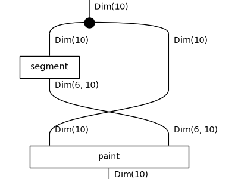
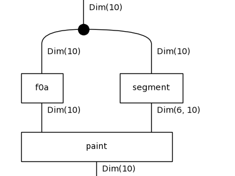

# Diagrammatic DreamCoder on 1D-ARC: results

Tasks: 180 (10 per family, drawn with seed 0), fitted on their 3 training pairs only, scored on the held-out test pair by exact match. Config: `results/default/config.json`.

## Per iteration

| iteration | top-1 test | top-3 test | train fit exactly | mean DL (bits) | library | candidates | wall-clock |
|---|---|---|---|---|---|---|---|
| 0 | 81/180 (45%) | 121/180 | 93/180 | 83.9 | 7 | 57 | 534s |
| 1 | 99/180 (55%) | 135/180 | 110/180 | 77.3 | 9 | 80 | 1198s |
| 2 | 101/180 (56%) | 137/180 | 112/180 | 77.3 | 11 | 80 | 1262s |

Top-1 is the prediction of the least-DL candidate; top-3 counts a hit among the three kept. Mean DL is over the best candidate of every task.

## Per family (top-1 test exact match)

| family | it 0 | it 1 | it 2 |
|---|---|---|---|
| denoising_1c | 6/10 | 7/10 | 8/10 |
| denoising_mc | 1/10 | 1/10 | 2/10 |
| fill | 3/10 | 7/10 | 8/10 |
| flip | 0/10 | 0/10 | 0/10 |
| hollow | 5/10 | 10/10 | 10/10 |
| mirror | 1/10 | 1/10 | 0/10 |
| move_1p | 9/10 | 9/10 | 9/10 |
| move_2p | 10/10 | 10/10 | 10/10 |
| move_2p_dp | 0/10 | 0/10 | 0/10 |
| move_3p | 10/10 | 10/10 | 10/10 |
| move_dp | 0/10 | 0/10 | 0/10 |
| padded_fill | 9/10 | 10/10 | 10/10 |
| pcopy_1c | 0/10 | 1/10 | 1/10 |
| pcopy_mc | 1/10 | 3/10 | 3/10 |
| recolor_cmp | 10/10 | 10/10 | 10/10 |
| recolor_cnt | 6/10 | 7/10 | 7/10 |
| recolor_oe | 6/10 | 9/10 | 9/10 |
| scale_dp | 4/10 | 4/10 | 4/10 |

## Library growth

- after iteration 0: `f0a : Grid -> Grid` := `recolour(paint(x, segment(x)))` (8 trained weight tensors inherited)
- after iteration 0: `f0b : Grid -> Grid` := `recolour(paint(x, scan(x)))` (8 trained weight tensors inherited)
- after iteration 1: `f1a : Grid -> Grid` := `paint(x, segment(x))` (5 trained weight tensors inherited)
- after iteration 1: `f1b : Grid -> Grid` := `paint(f0a(x), segment(x))` (13 trained weight tensors inherited)

`f0a`'s body:

`f0b`'s body:

`f1a`'s body:

`f1b`'s body:

## Examples from the last iteration

### Solved: `1d_move_3p_2`

`shift(x)`, DL 54.6 = 4.4 structure + 43.0 parameters + 7.3 data bits, fits its training pairs exactly.

| pair | input | output |
|---|---|---|
| train 0 | `.6666666666...................` | `....6666666666................` |
| train 1 | `....11111111111111111.........` | `.......11111111111111111......` |
| train 2 | `....55555555..................` | `.......55555555...............` |
| **test** | `.........777777777777777......` | `............777777777777777...` |
| predicted | | `............777777777777777...` |

### Solved: `1d_move_3p_34`

`shift(x)`, DL 53.1 = 4.4 structure + 43.3 parameters + 5.5 data bits, fits its training pairs exactly.

| pair | input | output |
|---|---|---|
| train 0 | `......6666.....` | `.........6666..` |
| train 1 | `.222...........` | `....222........` |
| train 2 | `.88888.........` | `....88888......` |
| **test** | `..88888........` | `.....88888.....` |
| predicted | | `.....88888.....` |

### Solved: `1d_scale_dp_15`

`recolour(paint(x, scan(x)))`, DL 57.7 = 10.5 structure + 47.1 parameters + 0.2 data bits, fits its training pairs exactly.

| pair | input | output |
|---|---|---|
| train 0 | `1111..7.....` | `1111117.....` |
| train 1 | `88888.....7.` | `88888888887.` |
| train 2 | `...5555....7` | `...555555557` |
| **test** | `44444..7....` | `44444447....` |
| predicted | | `44444447....` |

### Failed: `1d_denoising_mc_25`

`shift(x)`, DL 62.6 = 4.4 structure + 33.2 parameters + 25.0 data bits, does not fit its training pairs exactly.

| pair | input | output |
|---|---|---|
| train 0 | `....7778777768777777777747777....` | `....7777777777777777777777777....` |
| train 1 | `.......77777917777777777377777...` | `.......77777777777777777777777...` |
| train 2 | `...1111411111111111111111811.....` | `...1111111111111111111111111.....` |
| **test** | `......555585555555855555575555...` | `......555555555555555555555555...` |
| predicted | | `......555585555555855555575555...` |

### Failed: `1d_move_2p_dp_1`

`shift(x)`, DL 68.7 = 4.4 structure + 46.1 parameters + 18.3 data bits, does not fit its training pairs exactly.

| pair | input | output |
|---|---|---|
| train 0 | `.555555555555555555555..2.....` | `...5555555555555555555552.....` |
| train 1 | `......................1111..2.` | `........................11112.` |
| train 2 | `................777777..2.....` | `..................7777772.....` |
| **test** | `44444444444444444444444444..2.` | `..444444444444444444444444442.` |
| predicted | | `..44444444444444444444444444..` |

### Failed: `1d_pcopy_mc_32`

`shift(x)`, DL 87.3 = 4.4 structure + 47.3 parameters + 35.6 data bits, does not fit its training pairs exactly.

| pair | input | output |
|---|---|---|
| train 0 | `..999..1....9...................` | `..999.111..999..................` |
| train 1 | `..888...4.......................` | `..888..444......................` |
| train 2 | `.999....8...8...................` | `.999...888.888..................` |
| **test** | `.111...3...9....9...............` | `.111..333.999..999..............` |
| predicted | | `.111............................` |

## All best solutions, last iteration

| task | term | DL | test |
|---|---|---|---|
| 1d_denoising_1c_16 | `f1a(shift(x))` | 57.5 | ✓ |
| 1d_denoising_1c_22 | `paint(x, local(x))` | 55.0 | ✓ |
| 1d_denoising_1c_25 | `shift(x)` | 70.9 | ✓ |
| 1d_denoising_1c_27 | `f0b(f0a(x))` | 46.6 | ✓ |
| 1d_denoising_1c_31 | `paint(x, local(x))` | 54.0 | ✓ |
| 1d_denoising_1c_37 | `paint(x, local(x))` | 54.6 | ✓ |
| 1d_denoising_1c_39 | `f0b(f0a(x))` | 37.8 | ✓ |
| 1d_denoising_1c_44 | `shift(x)` | 70.5 | ✗ |
| 1d_denoising_1c_48 | `paint(shift(x), local(x))` | 71.0 | ✓ |
| 1d_denoising_1c_49 | `shift(x)` | 69.1 | ✗ |
| 1d_denoising_mc_0 | `shift(x)` | 58.6 | ✗ |
| 1d_denoising_mc_11 | `shift(x)` | 61.4 | ✗ |
| 1d_denoising_mc_15 | `paint(shift(x), local(x))` | 60.4 | ✓ |
| 1d_denoising_mc_21 | `shift(x)` | 61.2 | ✗ |
| 1d_denoising_mc_25 | `shift(x)` | 62.6 | ✗ |
| 1d_denoising_mc_30 | `shift(x)` | 65.1 | ✗ |
| 1d_denoising_mc_36 | `f1a(shift(x))` | 69.2 | ✓ |
| 1d_denoising_mc_44 | `shift(x)` | 59.0 | ✗ |
| 1d_denoising_mc_5 | `shift(x)` | 58.0 | ✗ |
| 1d_denoising_mc_6 | `shift(x)` | 55.1 | ✗ |
| 1d_fill_10 | `f0b(recolour(x))` | 43.0 | ✓ |
| 1d_fill_14 | `f1a(f0b(x))` | 63.6 | ✓ |
| 1d_fill_19 | `shift(x)` | 68.4 | ✗ |
| 1d_fill_28 | `shift(x)` | 63.0 | ✗ |
| 1d_fill_30 | `f0b(paint(x, local(x)))` | 59.7 | ✓ |
| 1d_fill_32 | `f0b(recolour(x))` | 45.6 | ✓ |
| 1d_fill_42 | `f0b(recolour(x))` | 49.7 | ✓ |
| 1d_fill_46 | `f1a(f0b(x))` | 72.2 | ✓ |
| 1d_fill_49 | `f0b(paint(x, local(x)))` | 42.8 | ✓ |
| 1d_fill_9 | `f0b(paint(x, scan(x)))` | 61.7 | ✓ |
| 1d_flip_1 | `paint(shift(x), local(x))` | 111.8 | ✗ |
| 1d_flip_12 | `paint(shift(x), scan(x))` | 129.7 | ✗ |
| 1d_flip_13 | `paint(recolour(x), scan(x))` | 108.8 | ✗ |
| 1d_flip_2 | `paint(shift(x), local(x))` | 90.0 | ✗ |
| 1d_flip_27 | `paint(shift(x), scan(x))` | 105.6 | ✗ |
| 1d_flip_28 | `f1a(x)` | 120.2 | ✗ |
| 1d_flip_36 | `f0b(paint(x, local(x)))` | 103.7 | ✗ |
| 1d_flip_38 | `paint(shift(x), scan(x))` | 123.8 | ✗ |
| 1d_flip_40 | `shift(x)` | 120.4 | ✗ |
| 1d_flip_42 | `paint(shift(x), scan(x))` | 109.7 | ✗ |
| 1d_hollow_0 | `f1a(f0a(x))` | 65.1 | ✓ |
| 1d_hollow_10 | `recolour(f0a(x))` | 31.2 | ✓ |
| 1d_hollow_17 | `paint(f0a(x), segment(x))` | 42.9 | ✓ |
| 1d_hollow_23 | `f1b(x)` | 47.9 | ✓ |
| 1d_hollow_24 | `paint(f0a(x), segment(x))` | 48.9 | ✓ |
| 1d_hollow_30 | `recolour(f0a(x))` | 30.1 | ✓ |
| 1d_hollow_33 | `f1b(x)` | 47.5 | ✓ |
| 1d_hollow_39 | `f1b(x)` | 39.4 | ✓ |
| 1d_hollow_40 | `recolour(f0a(x))` | 39.7 | ✓ |
| 1d_hollow_43 | `f1b(x)` | 54.4 | ✓ |
| 1d_mirror_1 | `shift(f1a(x))` | 164.7 | ✗ |
| 1d_mirror_13 | `f1a(x)` | 183.8 | ✗ |
| 1d_mirror_14 | `f1a(recolour(x))` | 147.9 | ✗ |
| 1d_mirror_23 | `f1a(recolour(x))` | 148.2 | ✗ |
| 1d_mirror_27 | `paint(x, scan(shift(x)))` | 182.0 | ✗ |
| 1d_mirror_28 | `paint(shift(x), scan(x))` | 186.7 | ✗ |
| 1d_mirror_37 | `paint(x, local(shift(x)))` | 120.9 | ✗ |
| 1d_mirror_42 | `f1a(paint(x, local(x)))` | 158.2 | ✗ |
| 1d_mirror_45 | `f1a(paint(x, local(x)))` | 115.9 | ✗ |
| 1d_mirror_47 | `f1a(paint(x, local(x)))` | 150.2 | ✗ |
| 1d_move_1p_10 | `shift(x)` | 52.9 | ✓ |
| 1d_move_1p_12 | `shift(x)` | 53.4 | ✓ |
| 1d_move_1p_16 | `shift(x)` | 53.5 | ✓ |
| 1d_move_1p_18 | `paint(shift(x), local(x))` | 52.1 | ✗ |
| 1d_move_1p_19 | `shift(x)` | 55.1 | ✓ |
| 1d_move_1p_3 | `shift(x)` | 52.8 | ✓ |
| 1d_move_1p_35 | `shift(x)` | 52.5 | ✓ |
| 1d_move_1p_36 | `shift(x)` | 54.7 | ✓ |
| 1d_move_1p_49 | `shift(x)` | 52.8 | ✓ |
| 1d_move_1p_8 | `shift(x)` | 55.2 | ✓ |
| 1d_move_2p_16 | `shift(x)` | 47.9 | ✓ |
| 1d_move_2p_25 | `shift(x)` | 48.5 | ✓ |
| 1d_move_2p_32 | `shift(x)` | 48.5 | ✓ |
| 1d_move_2p_36 | `shift(x)` | 48.4 | ✓ |
| 1d_move_2p_40 | `shift(x)` | 49.0 | ✓ |
| 1d_move_2p_41 | `shift(x)` | 48.0 | ✓ |
| 1d_move_2p_44 | `shift(x)` | 54.5 | ✓ |
| 1d_move_2p_45 | `shift(x)` | 48.3 | ✓ |
| 1d_move_2p_47 | `shift(x)` | 47.9 | ✓ |
| 1d_move_2p_5 | `shift(x)` | 46.2 | ✓ |
| 1d_move_2p_dp_1 | `shift(x)` | 68.7 | ✗ |
| 1d_move_2p_dp_11 | `shift(x)` | 70.3 | ✗ |
| 1d_move_2p_dp_18 | `shift(x)` | 66.7 | ✗ |
| 1d_move_2p_dp_21 | `shift(x)` | 67.3 | ✗ |
| 1d_move_2p_dp_30 | `shift(x)` | 65.6 | ✗ |
| 1d_move_2p_dp_38 | `shift(x)` | 66.7 | ✗ |
| 1d_move_2p_dp_42 | `shift(x)` | 68.4 | ✗ |
| 1d_move_2p_dp_47 | `shift(x)` | 67.3 | ✗ |
| 1d_move_2p_dp_48 | `shift(x)` | 70.3 | ✗ |
| 1d_move_2p_dp_7 | `shift(x)` | 59.8 | ✗ |
| 1d_move_3p_17 | `f1a(paint(x, local(x)))` | 53.6 | ✓ |
| 1d_move_3p_18 | `shift(x)` | 54.3 | ✓ |
| 1d_move_3p_2 | `shift(x)` | 54.6 | ✓ |
| 1d_move_3p_31 | `shift(x)` | 54.3 | ✓ |
| 1d_move_3p_32 | `shift(x)` | 53.7 | ✓ |
| 1d_move_3p_33 | `shift(x)` | 54.0 | ✓ |
| 1d_move_3p_34 | `shift(x)` | 53.1 | ✓ |
| 1d_move_3p_37 | `shift(x)` | 53.2 | ✓ |
| 1d_move_3p_42 | `shift(x)` | 54.0 | ✓ |
| 1d_move_3p_9 | `shift(x)` | 54.7 | ✓ |
| 1d_move_dp_1 | `shift(shift(x))` | 128.3 | ✗ |
| 1d_move_dp_13 | `recolour(paint(x, local(x)))` | 152.3 | ✗ |
| 1d_move_dp_18 | `shift(x)` | 105.8 | ✗ |
| 1d_move_dp_2 | `paint(f0a(x), scan(x))` | 191.5 | ✗ |
| 1d_move_dp_28 | `shift(shift(x))` | 137.5 | ✗ |
| 1d_move_dp_38 | `paint(x, scan(shift(x)))` | 155.1 | ✗ |
| 1d_move_dp_44 | `shift(x)` | 62.5 | ✗ |
| 1d_move_dp_49 | `shift(paint(x, scan(x)))` | 194.4 | ✗ |
| 1d_move_dp_5 | `shift(shift(x))` | 156.0 | ✗ |
| 1d_move_dp_8 | `shift(x)` | 63.6 | ✗ |
| 1d_padded_fill_18 | `f1a(f0b(x))` | 47.6 | ✓ |
| 1d_padded_fill_22 | `f1a(f0b(x))` | 62.7 | ✓ |
| 1d_padded_fill_23 | `paint(f0b(x), segment(x))` | 60.9 | ✓ |
| 1d_padded_fill_27 | `f0b(paint(x, scan(x)))` | 59.1 | ✓ |
| 1d_padded_fill_32 | `paint(f0b(x), segment(x))` | 60.5 | ✓ |
| 1d_padded_fill_40 | `f1a(f0b(x))` | 52.6 | ✓ |
| 1d_padded_fill_42 | `paint(f0b(x), segment(x))` | 51.3 | ✓ |
| 1d_padded_fill_6 | `f1a(f0b(x))` | 49.8 | ✓ |
| 1d_padded_fill_8 | `paint(f0b(x), segment(x))` | 49.3 | ✓ |
| 1d_padded_fill_9 | `f1a(f0b(x))` | 49.6 | ✓ |
| 1d_pcopy_1c_0 | `shift(x)` | 86.0 | ✗ |
| 1d_pcopy_1c_18 | `paint(f0a(x), local(x))` | 88.3 | ✓ |
| 1d_pcopy_1c_2 | `shift(x)` | 102.6 | ✗ |
| 1d_pcopy_1c_21 | `shift(x)` | 92.6 | ✗ |
| 1d_pcopy_1c_22 | `shift(x)` | 93.2 | ✗ |
| 1d_pcopy_1c_24 | `shift(x)` | 92.0 | ✗ |
| 1d_pcopy_1c_32 | `shift(x)` | 92.4 | ✗ |
| 1d_pcopy_1c_36 | `shift(x)` | 98.3 | ✗ |
| 1d_pcopy_1c_4 | `f1a(paint(x, local(x)))` | 76.4 | ✗ |
| 1d_pcopy_1c_49 | `shift(x)` | 92.1 | ✗ |
| 1d_pcopy_mc_12 | `paint(f0b(x), local(x))` | 49.4 | ✓ |
| 1d_pcopy_mc_21 | `paint(shift(x), local(x))` | 82.6 | ✓ |
| 1d_pcopy_mc_24 | `shift(x)` | 87.0 | ✗ |
| 1d_pcopy_mc_26 | `paint(f0b(x), local(x))` | 52.7 | ✓ |
| 1d_pcopy_mc_27 | `shift(x)` | 75.9 | ✗ |
| 1d_pcopy_mc_30 | `paint(f0b(x), local(x))` | 77.0 | ✗ |
| 1d_pcopy_mc_32 | `shift(x)` | 87.3 | ✗ |
| 1d_pcopy_mc_33 | `shift(x)` | 93.6 | ✗ |
| 1d_pcopy_mc_36 | `shift(x)` | 75.9 | ✗ |
| 1d_pcopy_mc_49 | `paint(f0b(x), local(x))` | 56.9 | ✗ |
| 1d_recolor_cmp_10 | `f1b(recolour(x))` | 45.7 | ✓ |
| 1d_recolor_cmp_11 | `paint(f0a(x), local(x))` | 33.9 | ✓ |
| 1d_recolor_cmp_18 | `paint(f0a(x), scan(x))` | 66.4 | ✓ |
| 1d_recolor_cmp_3 | `paint(f0a(x), local(x))` | 32.5 | ✓ |
| 1d_recolor_cmp_34 | `recolour(f1a(x))` | 53.7 | ✓ |
| 1d_recolor_cmp_36 | `recolour(f1a(x))` | 67.6 | ✓ |
| 1d_recolor_cmp_39 | `paint(f0a(x), local(x))` | 66.1 | ✓ |
| 1d_recolor_cmp_46 | `recolour(f1a(x))` | 55.1 | ✓ |
| 1d_recolor_cmp_8 | `recolour(f1a(x))` | 54.5 | ✓ |
| 1d_recolor_cmp_9 | `recolour(f1a(x))` | 54.7 | ✓ |
| 1d_recolor_cnt_1 | `f1b(x)` | 129.6 | ✓ |
| 1d_recolor_cnt_15 | `recolour(paint(x, scan(x)))` | 116.4 | ✗ |
| 1d_recolor_cnt_21 | `paint(shift(x), segment(x))` | 105.2 | ✓ |
| 1d_recolor_cnt_28 | `paint(f0a(x), local(x))` | 109.7 | ✓ |
| 1d_recolor_cnt_38 | `f0a(paint(x, local(x)))` | 92.2 | ✗ |
| 1d_recolor_cnt_4 | `f0a(f1a(x))` | 98.6 | ✓ |
| 1d_recolor_cnt_45 | `paint(f0a(x), scan(x))` | 103.5 | ✗ |
| 1d_recolor_cnt_46 | `paint(f1a(x), segment(x))` | 128.8 | ✓ |
| 1d_recolor_cnt_48 | `f0a(f1a(x))` | 98.6 | ✓ |
| 1d_recolor_cnt_9 | `f0a(f1a(x))` | 104.1 | ✓ |
| 1d_recolor_oe_12 | `paint(f1a(x), segment(x))` | 90.8 | ✓ |
| 1d_recolor_oe_14 | `paint(f1a(x), segment(x))` | 108.9 | ✓ |
| 1d_recolor_oe_17 | `paint(recolour(x), segment(x))` | 98.4 | ✓ |
| 1d_recolor_oe_19 | `paint(x, scan(x))` | 97.4 | ✗ |
| 1d_recolor_oe_25 | `paint(f1a(x), segment(x))` | 95.7 | ✓ |
| 1d_recolor_oe_27 | `paint(f0a(x), segment(x))` | 63.8 | ✓ |
| 1d_recolor_oe_32 | `recolour(f1a(x))` | 80.9 | ✓ |
| 1d_recolor_oe_35 | `recolour(f1a(x))` | 78.5 | ✓ |
| 1d_recolor_oe_43 | `paint(x, segment(f0b(x)))` | 69.4 | ✓ |
| 1d_recolor_oe_46 | `recolour(f0a(x))` | 113.9 | ✓ |
| 1d_scale_dp_10 | `paint(x, local(shift(x)))` | 105.3 | ✗ |
| 1d_scale_dp_15 | `recolour(paint(x, scan(x)))` | 57.7 | ✓ |
| 1d_scale_dp_20 | `recolour(paint(x, local(x)))` | 48.2 | ✗ |
| 1d_scale_dp_24 | `recolour(paint(x, local(x)))` | 61.7 | ✓ |
| 1d_scale_dp_27 | `paint(x, local(shift(x)))` | 88.4 | ✗ |
| 1d_scale_dp_3 | `recolour(paint(x, local(x)))` | 88.2 | ✓ |
| 1d_scale_dp_34 | `recolour(paint(x, local(x)))` | 63.3 | ✗ |
| 1d_scale_dp_36 | `shift(x)` | 66.5 | ✗ |
| 1d_scale_dp_49 | `recolour(paint(x, scan(x)))` | 58.0 | ✓ |
| 1d_scale_dp_5 | `paint(x, local(shift(x)))` | 92.7 | ✗ |
