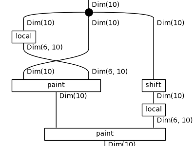
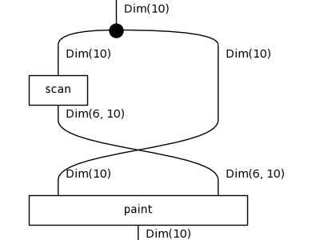
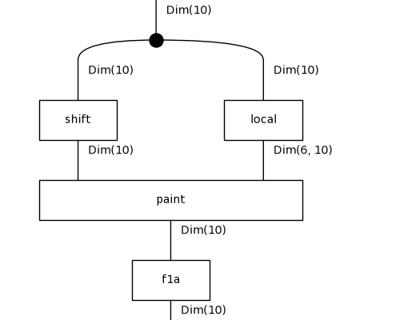
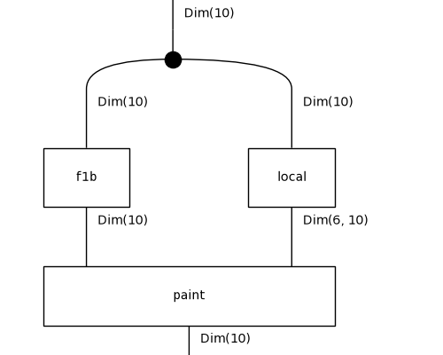
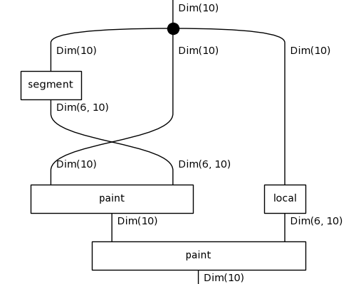
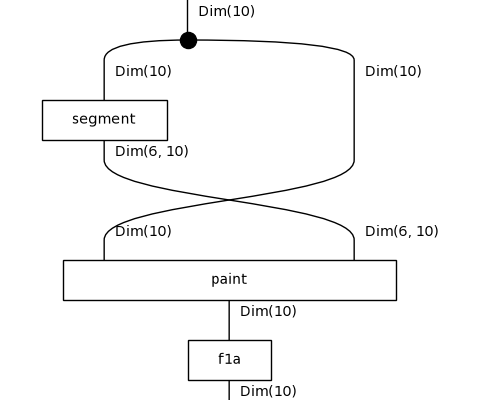
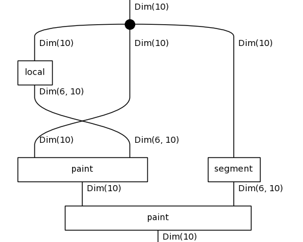

# Diagrammatic DreamCoder on 1D-ARC: results

Tasks: 901 (50 per family, drawn with seed 0), fitted on their 3 training pairs only, scored on the held-out test pair by exact match. Config: `/results/full5-l4/config.json`.

## Per iteration

| iteration | top-1 test | top-3 test | train fit exactly | mean DL (bits) | library | candidates | wall-clock |
|---|---|---|---|---|---|---|---|
| 0 | 538/901 (60%) | 671/901 | 629/901 | 76.4 | 7 | 150 | 473s |
| 1 | 569/901 (63%) | 690/901 | 652/901 | 75.9 | 9 | 150 | 559s |
| 2 | 575/901 (64%) | 686/901 | 666/901 | 77.7 | 11 | 150 | 621s |

Top-1 is the prediction of the least-DL candidate; top-3 counts a hit among the three kept. Mean DL is over the best candidate of every task.

## Per family (top-1 test exact match)

| family | it 0 | it 1 | it 2 |
|---|---|---|---|
| denoising_1c | 44/50 | 43/50 | 45/50 |
| denoising_mc | 15/50 | 21/50 | 23/50 |
| fill | 26/50 | 30/50 | 29/50 |
| flip | 4/50 | 5/50 | 5/50 |
| hollow | 34/50 | 34/50 | 35/50 |
| mirror | 1/50 | 1/50 | 1/50 |
| move_1p | 49/50 | 49/50 | 49/50 |
| move_2p | 50/50 | 50/50 | 50/50 |
| move_2p_dp | 27/50 | 33/50 | 35/50 |
| move_3p | 49/50 | 49/50 | 50/50 |
| move_dp | 0/50 | 1/50 | 1/50 |
| padded_fill | 47/50 | 49/50 | 47/50 |
| pcopy_1c | 8/50 | 10/50 | 10/50 |
| pcopy_mc | 29/50 | 30/50 | 32/50 |
| recolor_cmp | 48/50 | 50/50 | 49/50 |
| recolor_cnt | 37/50 | 42/50 | 37/50 |
| recolor_oe | 35/50 | 36/50 | 36/50 |
| scale_dp | 35/51 | 36/51 | 41/51 |

## Library growth

- after iteration 0: `f0a : Grid -> Grid` := `recolour(paint(x, segment(x)))` (8 trained weight tensors inherited)
- after iteration 0: `f0b : Grid -> Grid` := `paint(paint(x, local(x)), local(shift(x)))` (11 trained weight tensors inherited)
- after iteration 1: `f1a : Grid -> Grid` := `paint(x, local(x))` (5 trained weight tensors inherited)
- after iteration 1: `f1b : Grid -> Grid` := `paint(x, scan(x))` (5 trained weight tensors inherited)

`f0a`'s body:

`f0b`'s body:

`f1a`'s body:

`f1b`'s body:

## Examples from the last iteration

### Solved: `1d_denoising_1c_6`

`f1a(paint(shift(x), local(x)))`, DL 55.6 = 12.7 structure + 42.0 parameters + 0.9 data bits, fits its training pairs exactly.

| pair | input | output |
|---|---|---|
| train 0 | `....3...3..3...3.333333333333..3.` | `.................333333333333....` |
| train 1 | `...7....7..77777777777777..7.....` | `...........77777777777777........` |
| train 2 | `..2..2....22222222222222...2..2..` | `..........22222222222222.........` |
| **test** | `..8...8.888888888888..8..8....8..` | `........888888888888.............` |
| predicted | | `........888888888888.............` |

### Solved: `1d_pcopy_mc_29`

`paint(f1b(x), local(x))`, DL 71.7 = 9.7 structure + 61.5 parameters + 0.5 data bits, fits its training pairs exactly.

| pair | input | output |
|---|---|---|
| train 0 | `.555....5........................` | `.555...555.......................` |
| train 1 | `..555...4........................` | `..555..444.......................` |
| train 2 | `..444..9.........................` | `..444.999........................` |
| **test** | `..333..2.........................` | `..333.222........................` |
| predicted | | `..333.222........................` |

### Solved: `1d_recolor_cmp_26`

`paint(paint(x, segment(x)), local(x))`, DL 69.5 = 10.0 structure + 59.3 parameters + 0.2 data bits, fits its training pairs exactly.

| pair | input | output |
|---|---|---|
| train 0 | `..1111...1.11.1.1111.11....` | `..4444...1.11.1.4444.11....` |
| train 1 | `..11111.11...1...1111111...` | `..11111.11...1...4444444...` |
| train 2 | `..1111..11111..1111..11111.` | `..1111..44444..1111..44444.` |
| **test** | `...11111..11111.111111.....` | `...11111..11111.444444.....` |
| predicted | | `...11111..11111.444444.....` |

### Failed: `1d_move_dp_26`

`f1a(paint(shift(x), local(x)))`, DL 119.7 = 12.7 structure + 104.7 parameters + 2.3 data bits, fits its training pairs exactly.

| pair | input | output |
|---|---|---|
| train 0 | `..........888888888888888..9..` | `............8888888888888889..` |
| train 1 | `...........77777777777.....9..` | `................777777777779..` |
| train 2 | `.11111111.....9...............` | `......111111119...............` |
| **test** | `.1111111111111111111111...9...` | `....11111111111111111111119...` |
| predicted | | `......1111111111111111111111..` |

### Failed: `1d_pcopy_1c_16`

`f1a(paint(x, segment(x)))`, DL 90.7 = 10.6 structure + 79.3 parameters + 0.8 data bits, fits its training pairs exactly.

| pair | input | output |
|---|---|---|
| train 0 | `..999...9.......................` | `..999..999......................` |
| train 1 | `.222...2...2....................` | `.222..222.222...................` |
| train 2 | `..888....8.....8...8............` | `..888...888...888.888...........` |
| **test** | `..999..9...9....9...............` | `..999.999.999..999..............` |
| predicted | | `..999..99.999..999..............` |

### Failed: `1d_recolor_oe_6`

`paint(paint(x, local(x)), segment(x))`, DL 118.0 = 10.0 structure + 106.5 parameters + 1.5 data bits, fits its training pairs exactly.

| pair | input | output |
|---|---|---|
| train 0 | `..77...7.77777...777.77..` | `..44...6.66666...666.44..` |
| train 1 | `.777...7777.7777.7777..77` | `.666...4444.4444.4444..44` |
| train 2 | `.77777...77.77777.7.77...` | `.66666...44.66666.6.44...` |
| **test** | `..77777..77..77.7777.7777` | `..66666..44..44.4444.4444` |
| predicted | | `..66666..44..44.7777.7777` |

## All best solutions, last iteration

| task | term | DL | test |
|---|---|---|---|
| 1d_denoising_1c_0 | `paint(x, local(x))` | 45.2 | ✓ |
| 1d_denoising_1c_1 | `paint(x, local(x))` | 53.9 | ✓ |
| 1d_denoising_1c_10 | `paint(x, local(x))` | 52.9 | ✓ |
| 1d_denoising_1c_11 | `paint(x, local(x))` | 54.2 | ✓ |
| 1d_denoising_1c_12 | `paint(x, local(x))` | 46.9 | ✓ |
| 1d_denoising_1c_13 | `paint(x, local(x))` | 53.1 | ✓ |
| 1d_denoising_1c_14 | `paint(paint(x, local(shift(x))), local(x))` | 61.1 | ✗ |
| 1d_denoising_1c_15 | `paint(paint(x, local(x)), segment(shift(x)))` | 52.0 | ✓ |
| 1d_denoising_1c_16 | `paint(paint(shift(x), local(x)), local(x))` | 60.2 | ✓ |
| 1d_denoising_1c_17 | `paint(f1b(x), local(x))` | 57.5 | ✓ |
| 1d_denoising_1c_18 | `paint(x, local(f1b(x)))` | 64.6 | ✓ |
| 1d_denoising_1c_19 | `paint(f1a(shift(x)), local(x))` | 47.9 | ✗ |
| 1d_denoising_1c_2 | `paint(x, local(x))` | 57.3 | ✓ |
| 1d_denoising_1c_20 | `paint(x, scan(paint(x, local(x))))` | 51.4 | ✓ |
| 1d_denoising_1c_21 | `paint(paint(shift(x), local(x)), scan(x))` | 67.4 | ✓ |
| 1d_denoising_1c_22 | `f1b(paint(shift(x), local(x)))` | 53.3 | ✓ |
| 1d_denoising_1c_23 | `paint(x, local(x))` | 50.2 | ✓ |
| 1d_denoising_1c_24 | `paint(f1a(shift(x)), local(x))` | 62.4 | ✓ |
| 1d_denoising_1c_25 | `paint(paint(x, scan(shift(x))), local(x))` | 61.2 | ✓ |
| 1d_denoising_1c_26 | `paint(paint(x, scan(shift(x))), local(x))` | 62.0 | ✗ |
| 1d_denoising_1c_27 | `paint(paint(x, scan(shift(x))), local(x))` | 64.3 | ✓ |
| 1d_denoising_1c_28 | `paint(shift(x), local(x))` | 43.5 | ✓ |
| 1d_denoising_1c_29 | `paint(f1b(x), local(x))` | 61.4 | ✓ |
| 1d_denoising_1c_3 | `f1a(paint(shift(x), local(x)))` | 53.8 | ✓ |
| 1d_denoising_1c_30 | `paint(x, local(x))` | 59.0 | ✓ |
| 1d_denoising_1c_31 | `paint(x, local(x))` | 52.8 | ✓ |
| 1d_denoising_1c_32 | `paint(x, local(x))` | 51.8 | ✓ |
| 1d_denoising_1c_33 | `paint(shift(shift(x)), local(x))` | 44.2 | ✓ |
| 1d_denoising_1c_34 | `paint(x, local(x))` | 46.3 | ✓ |
| 1d_denoising_1c_35 | `paint(f1b(x), local(x))` | 64.3 | ✓ |
| 1d_denoising_1c_36 | `paint(paint(x, scan(shift(x))), local(x))` | 56.7 | ✓ |
| 1d_denoising_1c_37 | `paint(x, local(x))` | 53.4 | ✓ |
| 1d_denoising_1c_38 | `paint(x, local(x))` | 51.9 | ✓ |
| 1d_denoising_1c_39 | `paint(x, local(x))` | 53.8 | ✓ |
| 1d_denoising_1c_4 | `paint(f1b(x), local(x))` | 52.0 | ✓ |
| 1d_denoising_1c_40 | `paint(paint(shift(x), local(x)), segment(x))` | 62.7 | ✗ |
| 1d_denoising_1c_41 | `f1a(paint(shift(x), local(x)))` | 52.8 | ✓ |
| 1d_denoising_1c_42 | `paint(shift(x), local(x))` | 49.4 | ✓ |
| 1d_denoising_1c_43 | `paint(x, local(x))` | 52.1 | ✗ |
| 1d_denoising_1c_44 | `paint(x, local(f1b(x)))` | 60.6 | ✓ |
| 1d_denoising_1c_45 | `paint(x, local(x))` | 47.5 | ✓ |
| 1d_denoising_1c_46 | `paint(x, local(x))` | 52.7 | ✓ |
| 1d_denoising_1c_47 | `paint(f1a(shift(x)), local(x))` | 58.0 | ✓ |
| 1d_denoising_1c_48 | `paint(paint(shift(x), local(x)), scan(x))` | 66.9 | ✓ |
| 1d_denoising_1c_49 | `paint(paint(shift(x), local(x)), scan(x))` | 59.9 | ✓ |
| 1d_denoising_1c_5 | `paint(f1a(shift(x)), local(x))` | 61.6 | ✓ |
| 1d_denoising_1c_6 | `f1a(paint(shift(x), local(x)))` | 55.6 | ✓ |
| 1d_denoising_1c_7 | `f1a(paint(shift(x), local(x)))` | 59.5 | ✓ |
| 1d_denoising_1c_8 | `paint(x, local(x))` | 61.3 | ✓ |
| 1d_denoising_1c_9 | `paint(paint(shift(x), local(x)), scan(x))` | 57.3 | ✓ |
| 1d_denoising_mc_0 | `paint(shift(shift(x)), local(x))` | 51.6 | ✓ |
| 1d_denoising_mc_1 | `paint(shift(x), segment(shift(x)))` | 67.5 | ✓ |
| 1d_denoising_mc_10 | `shift(x)` | 66.3 | ✗ |
| 1d_denoising_mc_11 | `paint(paint(shift(x), local(x)), local(x))` | 57.8 | ✓ |
| 1d_denoising_mc_12 | `paint(shift(x), segment(shift(x)))` | 59.4 | ✓ |
| 1d_denoising_mc_13 | `shift(x)` | 63.3 | ✗ |
| 1d_denoising_mc_14 | `shift(x)` | 53.2 | ✗ |
| 1d_denoising_mc_15 | `paint(shift(x), local(x))` | 59.1 | ✓ |
| 1d_denoising_mc_16 | `shift(x)` | 61.5 | ✗ |
| 1d_denoising_mc_17 | `paint(shift(x), local(x))` | 56.7 | ✓ |
| 1d_denoising_mc_18 | `paint(shift(x), local(x))` | 71.1 | ✓ |
| 1d_denoising_mc_19 | `shift(x)` | 66.2 | ✗ |
| 1d_denoising_mc_2 | `shift(x)` | 67.4 | ✗ |
| 1d_denoising_mc_20 | `shift(x)` | 57.4 | ✗ |
| 1d_denoising_mc_21 | `paint(paint(shift(x), local(x)), local(x))` | 55.8 | ✓ |
| 1d_denoising_mc_22 | `paint(f1a(shift(x)), local(x))` | 33.5 | ✓ |
| 1d_denoising_mc_23 | `shift(x)` | 59.5 | ✗ |
| 1d_denoising_mc_24 | `paint(paint(shift(x), local(x)), local(x))` | 69.0 | ✓ |
| 1d_denoising_mc_25 | `shift(x)` | 62.3 | ✗ |
| 1d_denoising_mc_26 | `f0b(x)` | 62.0 | ✓ |
| 1d_denoising_mc_27 | `shift(x)` | 58.7 | ✗ |
| 1d_denoising_mc_28 | `paint(paint(shift(x), local(x)), local(x))` | 56.2 | ✓ |
| 1d_denoising_mc_29 | `f1a(paint(x, local(x)))` | 56.6 | ✗ |
| 1d_denoising_mc_3 | `paint(paint(shift(x), local(x)), local(x))` | 65.9 | ✓ |
| 1d_denoising_mc_30 | `paint(shift(shift(x)), local(x))` | 53.1 | ✓ |
| 1d_denoising_mc_31 | `f1a(paint(x, local(x)))` | 68.9 | ✓ |
| 1d_denoising_mc_32 | `shift(x)` | 63.9 | ✗ |
| 1d_denoising_mc_33 | `paint(f1a(shift(x)), local(x))` | 55.8 | ✗ |
| 1d_denoising_mc_34 | `paint(shift(x), local(x))` | 65.8 | ✓ |
| 1d_denoising_mc_35 | `paint(f1b(x), local(x))` | 59.8 | ✓ |
| 1d_denoising_mc_36 | `f1a(paint(shift(x), local(x)))` | 56.2 | ✓ |
| 1d_denoising_mc_37 | `shift(x)` | 64.4 | ✗ |
| 1d_denoising_mc_38 | `shift(x)` | 69.9 | ✗ |
| 1d_denoising_mc_39 | `shift(x)` | 68.4 | ✗ |
| 1d_denoising_mc_4 | `paint(shift(x), local(x))` | 66.4 | ✓ |
| 1d_denoising_mc_40 | `shift(x)` | 70.7 | ✗ |
| 1d_denoising_mc_41 | `shift(x)` | 52.5 | ✗ |
| 1d_denoising_mc_42 | `shift(x)` | 54.8 | ✗ |
| 1d_denoising_mc_43 | `shift(x)` | 52.9 | ✗ |
| 1d_denoising_mc_44 | `shift(x)` | 58.8 | ✗ |
| 1d_denoising_mc_45 | `shift(x)` | 71.5 | ✓ |
| 1d_denoising_mc_46 | `paint(shift(x), local(x))` | 52.5 | ✓ |
| 1d_denoising_mc_47 | `paint(paint(x, scan(shift(x))), local(x))` | 63.9 | ✓ |
| 1d_denoising_mc_48 | `f1b(paint(x, local(x)))` | 53.7 | ✓ |
| 1d_denoising_mc_49 | `paint(x, segment(shift(x)))` | 62.9 | ✗ |
| 1d_denoising_mc_5 | `shift(x)` | 57.8 | ✗ |
| 1d_denoising_mc_6 | `shift(x)` | 54.9 | ✗ |
| 1d_denoising_mc_7 | `shift(x)` | 54.0 | ✗ |
| 1d_denoising_mc_8 | `shift(x)` | 72.0 | ✗ |
| 1d_denoising_mc_9 | `shift(x)` | 65.5 | ✗ |
| 1d_fill_0 | `f1a(f1b(x))` | 76.7 | ✓ |
| 1d_fill_1 | `f1b(paint(x, local(x)))` | 94.1 | ✗ |
| 1d_fill_10 | `recolour(f1b(x))` | 47.1 | ✓ |
| 1d_fill_11 | `paint(x, scan(shift(x)))` | 98.4 | ✗ |
| 1d_fill_12 | `paint(f1b(x), segment(x))` | 42.2 | ✓ |
| 1d_fill_13 | `paint(paint(shift(x), scan(x)), local(x))` | 98.3 | ✓ |
| 1d_fill_14 | `paint(shift(x), local(paint(x, scan(x))))` | 99.2 | ✓ |
| 1d_fill_15 | `paint(x, scan(shift(x)))` | 107.9 | ✗ |
| 1d_fill_16 | `paint(x, local(f1b(x)))` | 75.3 | ✓ |
| 1d_fill_17 | `paint(x, local(f1b(x)))` | 94.8 | ✓ |
| 1d_fill_18 | `paint(paint(shift(x), scan(x)), local(x))` | 97.4 | ✓ |
| 1d_fill_19 | `shift(x)` | 68.1 | ✗ |
| 1d_fill_2 | `paint(paint(x, local(x)), scan(shift(x)))` | 92.1 | ✗ |
| 1d_fill_20 | `recolour(f1b(x))` | 61.4 | ✓ |
| 1d_fill_21 | `shift(x)` | 66.3 | ✗ |
| 1d_fill_22 | `shift(x)` | 82.3 | ✗ |
| 1d_fill_23 | `shift(x)` | 69.8 | ✗ |
| 1d_fill_24 | `paint(x, scan(shift(x)))` | 108.7 | ✗ |
| 1d_fill_25 | `paint(x, scan(shift(x)))` | 59.0 | ✗ |
| 1d_fill_26 | `paint(shift(paint(x, scan(x))), local(x))` | 102.4 | ✓ |
| 1d_fill_27 | `shift(x)` | 80.3 | ✗ |
| 1d_fill_28 | `paint(f1b(x), segment(x))` | 44.2 | ✓ |
| 1d_fill_29 | `paint(x, scan(shift(x)))` | 102.3 | ✗ |
| 1d_fill_3 | `paint(x, scan(paint(x, scan(x))))` | 90.2 | ✗ |
| 1d_fill_30 | `paint(shift(paint(x, scan(x))), local(x))` | 111.4 | ✓ |
| 1d_fill_31 | `paint(paint(shift(x), scan(x)), local(x))` | 75.6 | ✓ |
| 1d_fill_32 | `paint(paint(shift(x), scan(x)), local(x))` | 98.3 | ✓ |
| 1d_fill_33 | `paint(f1b(x), segment(x))` | 48.0 | ✓ |
| 1d_fill_34 | `paint(x, local(f1b(x)))` | 105.8 | ✓ |
| 1d_fill_35 | `paint(shift(paint(x, scan(x))), local(x))` | 119.6 | ✓ |
| 1d_fill_36 | `paint(x, scan(shift(x)))` | 75.9 | ✗ |
| 1d_fill_37 | `shift(x)` | 65.9 | ✗ |
| 1d_fill_38 | `paint(paint(shift(x), scan(x)), local(x))` | 81.6 | ✓ |
| 1d_fill_39 | `paint(paint(shift(x), scan(x)), local(x))` | 76.8 | ✓ |
| 1d_fill_4 | `paint(shift(paint(x, scan(x))), local(x))` | 120.1 | ✓ |
| 1d_fill_40 | `recolour(f1b(x))` | 57.2 | ✓ |
| 1d_fill_41 | `recolour(f1b(x))` | 48.9 | ✓ |
| 1d_fill_42 | `shift(x)` | 73.5 | ✗ |
| 1d_fill_43 | `paint(paint(x, scan(x)), local(shift(x)))` | 44.2 | ✓ |
| 1d_fill_44 | `shift(x)` | 59.1 | ✗ |
| 1d_fill_45 | `paint(shift(paint(x, scan(x))), local(x))` | 117.7 | ✓ |
| 1d_fill_46 | `shift(shift(x))` | 99.9 | ✗ |
| 1d_fill_47 | `paint(x, scan(shift(x)))` | 65.8 | ✗ |
| 1d_fill_48 | `paint(shift(paint(x, scan(x))), local(x))` | 97.3 | ✓ |
| 1d_fill_49 | `shift(x)` | 67.6 | ✗ |
| 1d_fill_5 | `shift(x)` | 87.6 | ✗ |
| 1d_fill_6 | `paint(x, scan(paint(x, scan(x))))` | 83.0 | ✓ |
| 1d_fill_7 | `paint(x, local(f1b(x)))` | 65.8 | ✓ |
| 1d_fill_8 | `paint(paint(shift(x), scan(x)), local(x))` | 78.2 | ✓ |
| 1d_fill_9 | `paint(paint(x, scan(x)), local(shift(x)))` | 44.6 | ✓ |
| 1d_flip_0 | `paint(paint(shift(x), local(x)), local(x))` | 77.3 | ✗ |
| 1d_flip_1 | `paint(paint(shift(x), local(x)), local(x))` | 106.7 | ✗ |
| 1d_flip_10 | `paint(paint(x, local(x)), segment(shift(x)))` | 81.9 | ✓ |
| 1d_flip_11 | `paint(paint(x, segment(x)), local(x))` | 85.2 | ✓ |
| 1d_flip_12 | `paint(f1a(shift(x)), local(x))` | 103.0 | ✗ |
| 1d_flip_13 | `paint(paint(x, local(shift(x))), segment(x))` | 91.0 | ✗ |
| 1d_flip_14 | `paint(paint(shift(x), local(x)), local(x))` | 78.4 | ✗ |
| 1d_flip_15 | `f1b(paint(x, segment(x)))` | 110.6 | ✗ |
| 1d_flip_16 | `paint(f1a(shift(x)), local(x))` | 96.2 | ✗ |
| 1d_flip_17 | `paint(f1a(shift(x)), local(x))` | 90.2 | ✗ |
| 1d_flip_18 | `paint(f1a(shift(x)), local(x))` | 96.5 | ✗ |
| 1d_flip_19 | `paint(paint(x, local(x)), segment(shift(x)))` | 91.1 | ✗ |
| 1d_flip_2 | `paint(paint(shift(x), local(x)), local(x))` | 77.0 | ✗ |
| 1d_flip_20 | `paint(paint(x, local(shift(x))), segment(x))` | 116.2 | ✗ |
| 1d_flip_21 | `paint(paint(shift(x), local(x)), local(x))` | 76.3 | ✗ |
| 1d_flip_22 | `paint(f1a(shift(x)), local(x))` | 94.8 | ✗ |
| 1d_flip_23 | `paint(paint(shift(x), local(x)), local(x))` | 83.5 | ✗ |
| 1d_flip_24 | `paint(f1a(shift(x)), local(x))` | 102.3 | ✗ |
| 1d_flip_25 | `paint(f1a(shift(x)), local(x))` | 108.4 | ✗ |
| 1d_flip_26 | `paint(f1a(shift(x)), local(x))` | 106.2 | ✗ |
| 1d_flip_27 | `paint(shift(shift(x)), local(x))` | 82.7 | ✗ |
| 1d_flip_28 | `f1a(paint(x, local(shift(x))))` | 96.5 | ✗ |
| 1d_flip_29 | `paint(paint(shift(x), local(x)), local(x))` | 77.3 | ✗ |
| 1d_flip_3 | `paint(paint(shift(x), local(x)), local(x))` | 83.0 | ✓ |
| 1d_flip_30 | `paint(f1a(shift(x)), local(x))` | 75.5 | ✗ |
| 1d_flip_31 | `paint(f1a(shift(x)), local(x))` | 95.0 | ✗ |
| 1d_flip_32 | `paint(f1a(shift(x)), local(x))` | 81.2 | ✗ |
| 1d_flip_33 | `paint(shift(paint(x, scan(x))), local(x))` | 108.9 | ✓ |
| 1d_flip_34 | `paint(paint(shift(x), local(x)), local(x))` | 105.9 | ✗ |
| 1d_flip_35 | `paint(f1a(shift(x)), local(x))` | 108.9 | ✗ |
| 1d_flip_36 | `paint(f1a(shift(x)), local(x))` | 99.2 | ✗ |
| 1d_flip_37 | `paint(f1a(shift(x)), local(x))` | 93.0 | ✗ |
| 1d_flip_38 | `paint(f1a(shift(x)), local(x))` | 101.4 | ✗ |
| 1d_flip_39 | `paint(paint(x, local(x)), segment(shift(x)))` | 57.2 | ✗ |
| 1d_flip_4 | `paint(paint(x, local(x)), segment(shift(x)))` | 89.9 | ✗ |
| 1d_flip_40 | `paint(paint(shift(x), local(x)), segment(x))` | 98.0 | ✗ |
| 1d_flip_41 | `paint(paint(shift(x), local(x)), local(x))` | 74.5 | ✗ |
| 1d_flip_42 | `paint(paint(shift(x), local(x)), local(x))` | 96.2 | ✗ |
| 1d_flip_43 | `paint(paint(shift(x), local(x)), local(x))` | 110.7 | ✗ |
| 1d_flip_44 | `paint(f1a(shift(x)), local(x))` | 86.1 | ✗ |
| 1d_flip_45 | `f1a(f1b(x))` | 97.9 | ✗ |
| 1d_flip_46 | `paint(paint(shift(x), local(x)), local(x))` | 71.9 | ✗ |
| 1d_flip_47 | `paint(f1a(shift(x)), local(x))` | 78.9 | ✗ |
| 1d_flip_48 | `paint(paint(x, local(shift(x))), local(x))` | 104.0 | ✗ |
| 1d_flip_49 | `paint(f1a(shift(x)), local(x))` | 82.8 | ✗ |
| 1d_flip_5 | `paint(paint(shift(x), local(x)), segment(x))` | 109.6 | ✗ |
| 1d_flip_6 | `f1a(paint(shift(x), local(x)))` | 109.4 | ✗ |
| 1d_flip_7 | `paint(paint(shift(x), local(x)), local(x))` | 83.0 | ✓ |
| 1d_flip_8 | `paint(paint(x, local(x)), segment(shift(x)))` | 60.5 | ✗ |
| 1d_flip_9 | `paint(paint(shift(x), local(x)), local(x))` | 99.8 | ✗ |
| 1d_hollow_0 | `paint(paint(x, segment(x)), segment(x))` | 93.0 | ✗ |
| 1d_hollow_1 | `paint(f0a(x), local(x))` | 58.4 | ✓ |
| 1d_hollow_10 | `paint(f1b(x), segment(x))` | 61.2 | ✓ |
| 1d_hollow_11 | `paint(paint(shift(x), local(x)), segment(x))` | 86.5 | ✗ |
| 1d_hollow_12 | `recolour(f1b(x))` | 65.4 | ✓ |
| 1d_hollow_13 | `f0a(shift(x))` | 78.4 | ✓ |
| 1d_hollow_14 | `paint(f1b(x), segment(x))` | 62.2 | ✓ |
| 1d_hollow_15 | `f0a(shift(x))` | 57.7 | ✗ |
| 1d_hollow_16 | `paint(paint(x, local(x)), segment(x))` | 58.0 | ✓ |
| 1d_hollow_17 | `paint(f1b(x), segment(x))` | 62.4 | ✓ |
| 1d_hollow_18 | `paint(f0a(x), local(x))` | 54.2 | ✓ |
| 1d_hollow_19 | `shift(x)` | 70.2 | ✗ |
| 1d_hollow_2 | `recolour(f1b(x))` | 62.0 | ✓ |
| 1d_hollow_20 | `paint(paint(shift(x), local(x)), scan(x))` | 90.8 | ✓ |
| 1d_hollow_21 | `shift(x)` | 69.0 | ✗ |
| 1d_hollow_22 | `paint(shift(x), segment(x))` | 87.7 | ✓ |
| 1d_hollow_23 | `paint(f1b(x), segment(x))` | 70.0 | ✓ |
| 1d_hollow_24 | `paint(paint(shift(x), local(x)), local(x))` | 92.2 | ✓ |
| 1d_hollow_25 | `shift(x)` | 55.6 | ✗ |
| 1d_hollow_26 | `paint(f0a(x), local(x))` | 61.0 | ✓ |
| 1d_hollow_27 | `paint(shift(x), segment(x))` | 66.7 | ✗ |
| 1d_hollow_28 | `shift(x)` | 67.4 | ✗ |
| 1d_hollow_29 | `paint(x, local(recolour(x)))` | 66.3 | ✗ |
| 1d_hollow_3 | `paint(f1b(x), segment(x))` | 59.6 | ✓ |
| 1d_hollow_30 | `paint(f1b(x), segment(x))` | 60.7 | ✓ |
| 1d_hollow_31 | `paint(f0a(x), local(x))` | 48.1 | ✓ |
| 1d_hollow_32 | `paint(f0a(x), local(x))` | 56.3 | ✓ |
| 1d_hollow_33 | `paint(f0a(x), local(x))` | 80.5 | ✓ |
| 1d_hollow_34 | `paint(f0a(x), local(x))` | 60.1 | ✓ |
| 1d_hollow_35 | `paint(f0a(x), local(x))` | 53.0 | ✓ |
| 1d_hollow_36 | `shift(x)` | 77.5 | ✗ |
| 1d_hollow_37 | `shift(x)` | 65.3 | ✗ |
| 1d_hollow_38 | `paint(f0a(x), local(x))` | 57.6 | ✓ |
| 1d_hollow_39 | `paint(shift(shift(x)), segment(x))` | 78.3 | ✗ |
| 1d_hollow_4 | `f1a(paint(x, segment(x)))` | 80.7 | ✓ |
| 1d_hollow_40 | `f1a(f1b(x))` | 83.4 | ✓ |
| 1d_hollow_41 | `paint(f1b(x), segment(x))` | 60.8 | ✓ |
| 1d_hollow_42 | `recolour(f1b(x))` | 69.1 | ✓ |
| 1d_hollow_43 | `recolour(f1b(x))` | 65.2 | ✓ |
| 1d_hollow_44 | `shift(x)` | 50.6 | ✗ |
| 1d_hollow_45 | `paint(paint(x, local(x)), segment(shift(x)))` | 80.9 | ✓ |
| 1d_hollow_46 | `paint(paint(shift(x), local(x)), scan(x))` | 83.4 | ✓ |
| 1d_hollow_47 | `paint(f1b(x), segment(x))` | 63.0 | ✓ |
| 1d_hollow_48 | `paint(f0a(x), local(x))` | 66.2 | ✓ |
| 1d_hollow_49 | `paint(paint(shift(x), local(x)), scan(x))` | 52.3 | ✗ |
| 1d_hollow_5 | `paint(shift(x), segment(x))` | 90.9 | ✓ |
| 1d_hollow_6 | `recolour(paint(x, local(x)))` | 90.4 | ✓ |
| 1d_hollow_7 | `paint(f1b(x), segment(x))` | 62.4 | ✓ |
| 1d_hollow_8 | `paint(shift(x), segment(x))` | 63.4 | ✗ |
| 1d_hollow_9 | `paint(f0a(x), local(x))` | 79.2 | ✓ |
| 1d_mirror_0 | `paint(paint(x, local(x)), scan(shift(x)))` | 202.3 | ✗ |
| 1d_mirror_1 | `paint(f1b(x), segment(x))` | 150.4 | ✗ |
| 1d_mirror_10 | `f1b(paint(x, local(x)))` | 168.3 | ✗ |
| 1d_mirror_11 | `paint(f1b(x), segment(x))` | 179.3 | ✗ |
| 1d_mirror_12 | `paint(f1b(x), segment(x))` | 133.7 | ✗ |
| 1d_mirror_13 | `shift(shift(paint(x, segment(x))))` | 167.4 | ✗ |
| 1d_mirror_14 | `paint(f1b(x), segment(x))` | 154.5 | ✗ |
| 1d_mirror_15 | `paint(f1b(x), segment(x))` | 158.7 | ✗ |
| 1d_mirror_16 | `paint(paint(x, local(x)), segment(shift(x)))` | 168.2 | ✗ |
| 1d_mirror_17 | `paint(f1b(x), segment(x))` | 177.9 | ✗ |
| 1d_mirror_18 | `paint(f1b(x), segment(x))` | 158.3 | ✗ |
| 1d_mirror_19 | `paint(paint(x, local(x)), segment(shift(x)))` | 177.2 | ✗ |
| 1d_mirror_2 | `paint(paint(x, local(x)), scan(x))` | 148.7 | ✗ |
| 1d_mirror_20 | `paint(f1b(x), segment(x))` | 134.6 | ✗ |
| 1d_mirror_21 | `paint(paint(x, local(shift(x))), segment(x))` | 107.7 | ✓ |
| 1d_mirror_22 | `paint(x, scan(paint(x, local(shift(x)))))` | 143.7 | ✗ |
| 1d_mirror_23 | `recolour(f1b(x))` | 164.8 | ✗ |
| 1d_mirror_24 | `paint(f1b(x), segment(x))` | 146.5 | ✗ |
| 1d_mirror_25 | `shift(shift(paint(x, segment(x))))` | 192.5 | ✗ |
| 1d_mirror_26 | `paint(f1b(x), segment(x))` | 132.4 | ✗ |
| 1d_mirror_27 | `paint(x, scan(shift(x)))` | 164.7 | ✗ |
| 1d_mirror_28 | `paint(paint(x, scan(x)), scan(x))` | 159.6 | ✗ |
| 1d_mirror_29 | `paint(paint(x, local(x)), local(shift(x)))` | 149.5 | ✗ |
| 1d_mirror_3 | `paint(f1b(x), segment(x))` | 138.5 | ✗ |
| 1d_mirror_30 | `recolour(f1b(x))` | 189.6 | ✗ |
| 1d_mirror_31 | `f1b(paint(x, local(x)))` | 139.8 | ✗ |
| 1d_mirror_32 | `paint(paint(x, local(x)), scan(shift(x)))` | 193.1 | ✗ |
| 1d_mirror_33 | `f1b(recolour(x))` | 177.9 | ✗ |
| 1d_mirror_34 | `f0b(x)` | 118.6 | ✗ |
| 1d_mirror_35 | `paint(shift(paint(x, local(x))), scan(x))` | 166.8 | ✗ |
| 1d_mirror_36 | `paint(f1b(x), segment(x))` | 158.7 | ✗ |
| 1d_mirror_37 | `paint(paint(x, segment(x)), scan(x))` | 109.6 | ✗ |
| 1d_mirror_38 | `paint(f1b(x), segment(x))` | 197.3 | ✗ |
| 1d_mirror_39 | `paint(f1b(x), segment(x))` | 193.3 | ✗ |
| 1d_mirror_4 | `paint(f1b(x), segment(x))` | 172.6 | ✗ |
| 1d_mirror_40 | `paint(paint(x, local(x)), segment(x))` | 135.2 | ✗ |
| 1d_mirror_41 | `paint(x, local(shift(x)))` | 112.6 | ✗ |
| 1d_mirror_42 | `f1b(paint(x, local(x)))` | 143.2 | ✗ |
| 1d_mirror_43 | `paint(f1b(x), segment(x))` | 132.4 | ✗ |
| 1d_mirror_44 | `paint(paint(x, local(x)), scan(x))` | 146.2 | ✗ |
| 1d_mirror_45 | `paint(paint(x, local(x)), local(shift(x)))` | 109.8 | ✗ |
| 1d_mirror_46 | `paint(paint(x, local(shift(x))), segment(x))` | 113.3 | ✗ |
| 1d_mirror_47 | `paint(f1b(x), segment(x))` | 124.3 | ✗ |
| 1d_mirror_48 | `shift(shift(paint(x, segment(x))))` | 154.7 | ✗ |
| 1d_mirror_49 | `paint(f1b(x), segment(x))` | 150.9 | ✗ |
| 1d_mirror_5 | `paint(f1b(x), segment(x))` | 178.3 | ✗ |
| 1d_mirror_6 | `paint(f1b(x), segment(x))` | 163.3 | ✗ |
| 1d_mirror_7 | `f0b(x)` | 119.8 | ✗ |
| 1d_mirror_8 | `paint(shift(x), scan(shift(x)))` | 163.3 | ✗ |
| 1d_mirror_9 | `paint(f1b(x), segment(x))` | 150.5 | ✗ |
| 1d_move_1p_0 | `f1a(paint(x, local(shift(x))))` | 53.9 | ✓ |
| 1d_move_1p_1 | `shift(x)` | 52.6 | ✓ |
| 1d_move_1p_10 | `shift(x)` | 52.7 | ✓ |
| 1d_move_1p_11 | `shift(x)` | 52.6 | ✓ |
| 1d_move_1p_12 | `shift(x)` | 53.2 | ✓ |
| 1d_move_1p_13 | `paint(shift(paint(x, local(x))), local(x))` | 52.7 | ✓ |
| 1d_move_1p_14 | `f1a(paint(x, local(shift(x))))` | 51.0 | ✓ |
| 1d_move_1p_15 | `shift(x)` | 55.3 | ✓ |
| 1d_move_1p_16 | `shift(x)` | 53.3 | ✓ |
| 1d_move_1p_17 | `paint(shift(x), local(x))` | 52.2 | ✓ |
| 1d_move_1p_18 | `paint(shift(x), local(x))` | 50.8 | ✗ |
| 1d_move_1p_19 | `shift(x)` | 54.9 | ✓ |
| 1d_move_1p_2 | `f1a(paint(x, local(shift(x))))` | 47.5 | ✓ |
| 1d_move_1p_20 | `paint(shift(shift(x)), local(x))` | 50.8 | ✓ |
| 1d_move_1p_21 | `shift(x)` | 54.1 | ✓ |
| 1d_move_1p_22 | `paint(shift(x), local(x))` | 52.2 | ✓ |
| 1d_move_1p_23 | `paint(shift(x), local(x))` | 48.3 | ✓ |
| 1d_move_1p_24 | `shift(x)` | 52.1 | ✓ |
| 1d_move_1p_25 | `paint(shift(paint(x, local(x))), local(x))` | 54.6 | ✓ |
| 1d_move_1p_26 | `f1a(paint(x, local(shift(x))))` | 46.4 | ✓ |
| 1d_move_1p_27 | `shift(x)` | 56.2 | ✓ |
| 1d_move_1p_28 | `shift(x)` | 54.3 | ✓ |
| 1d_move_1p_29 | `paint(shift(x), local(x))` | 54.2 | ✓ |
| 1d_move_1p_3 | `f1a(paint(x, local(shift(x))))` | 45.5 | ✓ |
| 1d_move_1p_30 | `shift(x)` | 54.6 | ✓ |
| 1d_move_1p_31 | `f1a(paint(x, local(shift(x))))` | 52.3 | ✓ |
| 1d_move_1p_32 | `shift(x)` | 54.5 | ✓ |
| 1d_move_1p_33 | `f1a(paint(x, local(shift(x))))` | 51.7 | ✓ |
| 1d_move_1p_34 | `shift(x)` | 54.0 | ✓ |
| 1d_move_1p_35 | `shift(x)` | 52.3 | ✓ |
| 1d_move_1p_36 | `paint(shift(shift(x)), local(x))` | 52.4 | ✓ |
| 1d_move_1p_37 | `shift(x)` | 55.0 | ✓ |
| 1d_move_1p_38 | `shift(x)` | 54.9 | ✓ |
| 1d_move_1p_39 | `shift(x)` | 55.9 | ✓ |
| 1d_move_1p_4 | `shift(x)` | 52.6 | ✓ |
| 1d_move_1p_40 | `paint(shift(x), local(x))` | 50.7 | ✓ |
| 1d_move_1p_41 | `shift(x)` | 53.5 | ✓ |
| 1d_move_1p_42 | `shift(x)` | 54.0 | ✓ |
| 1d_move_1p_43 | `paint(shift(paint(x, local(x))), local(x))` | 54.6 | ✓ |
| 1d_move_1p_44 | `shift(x)` | 56.3 | ✓ |
| 1d_move_1p_45 | `shift(x)` | 53.8 | ✓ |
| 1d_move_1p_46 | `paint(shift(x), local(x))` | 50.7 | ✓ |
| 1d_move_1p_47 | `f1a(paint(x, local(shift(x))))` | 47.2 | ✓ |
| 1d_move_1p_48 | `shift(x)` | 54.3 | ✓ |
| 1d_move_1p_49 | `f1a(paint(x, local(shift(x))))` | 47.8 | ✓ |
| 1d_move_1p_5 | `f1a(paint(x, local(shift(x))))` | 46.4 | ✓ |
| 1d_move_1p_6 | `paint(shift(shift(x)), local(x))` | 52.4 | ✓ |
| 1d_move_1p_7 | `shift(x)` | 55.9 | ✓ |
| 1d_move_1p_8 | `shift(x)` | 54.9 | ✓ |
| 1d_move_1p_9 | `f1a(paint(x, local(shift(x))))` | 46.7 | ✓ |
| 1d_move_2p_0 | `shift(x)` | 48.2 | ✓ |
| 1d_move_2p_1 | `shift(x)` | 46.9 | ✓ |
| 1d_move_2p_10 | `shift(x)` | 47.2 | ✓ |
| 1d_move_2p_11 | `shift(x)` | 47.2 | ✓ |
| 1d_move_2p_12 | `shift(x)` | 47.4 | ✓ |
| 1d_move_2p_13 | `shift(x)` | 47.9 | ✓ |
| 1d_move_2p_14 | `shift(x)` | 47.8 | ✓ |
| 1d_move_2p_15 | `shift(x)` | 48.4 | ✓ |
| 1d_move_2p_16 | `shift(x)` | 47.6 | ✓ |
| 1d_move_2p_17 | `shift(x)` | 48.0 | ✓ |
| 1d_move_2p_18 | `shift(x)` | 48.6 | ✓ |
| 1d_move_2p_19 | `shift(x)` | 48.5 | ✓ |
| 1d_move_2p_2 | `shift(x)` | 47.0 | ✓ |
| 1d_move_2p_20 | `shift(x)` | 47.6 | ✓ |
| 1d_move_2p_21 | `shift(x)` | 47.9 | ✓ |
| 1d_move_2p_22 | `shift(x)` | 48.1 | ✓ |
| 1d_move_2p_23 | `shift(x)` | 48.4 | ✓ |
| 1d_move_2p_24 | `shift(x)` | 46.7 | ✓ |
| 1d_move_2p_25 | `shift(x)` | 48.3 | ✓ |
| 1d_move_2p_26 | `shift(x)` | 47.0 | ✓ |
| 1d_move_2p_27 | `shift(x)` | 49.0 | ✓ |
| 1d_move_2p_28 | `shift(x)` | 48.2 | ✓ |
| 1d_move_2p_29 | `shift(x)` | 48.7 | ✓ |
| 1d_move_2p_3 | `paint(paint(shift(x), local(x)), segment(x))` | 41.7 | ✓ |
| 1d_move_2p_30 | `shift(x)` | 48.4 | ✓ |
| 1d_move_2p_31 | `shift(x)` | 48.5 | ✓ |
| 1d_move_2p_32 | `shift(x)` | 48.3 | ✓ |
| 1d_move_2p_33 | `shift(x)` | 47.0 | ✓ |
| 1d_move_2p_34 | `shift(x)` | 48.0 | ✓ |
| 1d_move_2p_35 | `shift(x)` | 46.9 | ✓ |
| 1d_move_2p_36 | `shift(x)` | 48.2 | ✓ |
| 1d_move_2p_37 | `shift(x)` | 48.3 | ✓ |
| 1d_move_2p_38 | `shift(x)` | 48.4 | ✓ |
| 1d_move_2p_39 | `shift(x)` | 48.9 | ✓ |
| 1d_move_2p_4 | `shift(x)` | 46.9 | ✓ |
| 1d_move_2p_40 | `shift(x)` | 48.8 | ✓ |
| 1d_move_2p_41 | `shift(x)` | 47.8 | ✓ |
| 1d_move_2p_42 | `shift(x)` | 47.9 | ✓ |
| 1d_move_2p_43 | `paint(paint(shift(x), local(x)), segment(x))` | 43.8 | ✓ |
| 1d_move_2p_44 | `shift(x)` | 54.2 | ✓ |
| 1d_move_2p_45 | `shift(x)` | 48.0 | ✓ |
| 1d_move_2p_46 | `shift(x)` | 48.6 | ✓ |
| 1d_move_2p_47 | `shift(x)` | 47.7 | ✓ |
| 1d_move_2p_48 | `shift(x)` | 48.2 | ✓ |
| 1d_move_2p_49 | `shift(x)` | 47.0 | ✓ |
| 1d_move_2p_5 | `shift(x)` | 46.0 | ✓ |
| 1d_move_2p_6 | `paint(paint(shift(x), local(x)), segment(x))` | 44.8 | ✓ |
| 1d_move_2p_7 | `paint(paint(x, local(x)), local(shift(x)))` | 44.0 | ✓ |
| 1d_move_2p_8 | `shift(x)` | 48.4 | ✓ |
| 1d_move_2p_9 | `paint(paint(shift(x), local(x)), segment(x))` | 44.4 | ✓ |
| 1d_move_2p_dp_0 | `paint(paint(x, local(x)), segment(shift(x)))` | 56.8 | ✗ |
| 1d_move_2p_dp_1 | `f1b(paint(x, local(x)))` | 50.3 | ✓ |
| 1d_move_2p_dp_10 | `f0b(x)` | 62.0 | ✓ |
| 1d_move_2p_dp_11 | `paint(paint(x, local(x)), scan(x))` | 63.6 | ✓ |
| 1d_move_2p_dp_12 | `paint(paint(shift(x), local(x)), scan(x))` | 66.1 | ✓ |
| 1d_move_2p_dp_13 | `paint(paint(x, local(x)), local(shift(x)))` | 58.5 | ✓ |
| 1d_move_2p_dp_14 | `paint(paint(x, local(x)), local(shift(x)))` | 57.4 | ✓ |
| 1d_move_2p_dp_15 | `paint(paint(x, local(x)), local(shift(x)))` | 54.8 | ✓ |
| 1d_move_2p_dp_16 | `paint(paint(x, local(x)), local(shift(x)))` | 61.0 | ✓ |
| 1d_move_2p_dp_17 | `f1b(paint(x, local(x)))` | 56.8 | ✗ |
| 1d_move_2p_dp_18 | `paint(paint(x, local(x)), local(shift(x)))` | 54.7 | ✗ |
| 1d_move_2p_dp_19 | `paint(paint(x, local(x)), local(shift(x)))` | 52.0 | ✓ |
| 1d_move_2p_dp_2 | `paint(paint(x, local(x)), local(shift(x)))` | 65.9 | ✓ |
| 1d_move_2p_dp_20 | `paint(paint(x, local(x)), segment(shift(x)))` | 56.7 | ✗ |
| 1d_move_2p_dp_21 | `paint(paint(x, local(x)), local(shift(x)))` | 58.8 | ✓ |
| 1d_move_2p_dp_22 | `f1b(paint(x, local(x)))` | 50.1 | ✗ |
| 1d_move_2p_dp_23 | `shift(x)` | 70.4 | ✗ |
| 1d_move_2p_dp_24 | `f1a(f1b(x))` | 61.9 | ✓ |
| 1d_move_2p_dp_25 | `paint(paint(x, local(x)), local(shift(x)))` | 60.7 | ✓ |
| 1d_move_2p_dp_26 | `paint(paint(x, local(x)), local(shift(x)))` | 57.8 | ✓ |
| 1d_move_2p_dp_27 | `paint(paint(x, local(x)), segment(shift(x)))` | 53.8 | ✓ |
| 1d_move_2p_dp_28 | `f0b(x)` | 59.8 | ✓ |
| 1d_move_2p_dp_29 | `paint(paint(x, local(x)), segment(shift(x)))` | 47.6 | ✓ |
| 1d_move_2p_dp_3 | `paint(paint(x, local(x)), local(shift(x)))` | 58.1 | ✓ |
| 1d_move_2p_dp_30 | `shift(x)` | 65.4 | ✗ |
| 1d_move_2p_dp_31 | `f1a(f1b(x))` | 63.7 | ✓ |
| 1d_move_2p_dp_32 | `f0b(x)` | 60.0 | ✓ |
| 1d_move_2p_dp_33 | `paint(paint(x, local(x)), local(shift(x)))` | 66.2 | ✓ |
| 1d_move_2p_dp_34 | `paint(paint(x, local(x)), segment(shift(x)))` | 51.9 | ✓ |
| 1d_move_2p_dp_35 | `f0b(x)` | 61.4 | ✓ |
| 1d_move_2p_dp_36 | `paint(paint(x, local(x)), local(shift(x)))` | 60.9 | ✓ |
| 1d_move_2p_dp_37 | `f1b(paint(x, local(x)))` | 55.6 | ✗ |
| 1d_move_2p_dp_38 | `f1b(paint(x, local(x)))` | 50.4 | ✗ |
| 1d_move_2p_dp_39 | `paint(paint(x, local(x)), local(shift(x)))` | 59.4 | ✓ |
| 1d_move_2p_dp_4 | `f1b(paint(x, local(x)))` | 55.5 | ✓ |
| 1d_move_2p_dp_40 | `paint(paint(shift(x), local(x)), scan(x))` | 59.1 | ✓ |
| 1d_move_2p_dp_41 | `shift(x)` | 66.3 | ✗ |
| 1d_move_2p_dp_42 | `paint(paint(x, local(x)), local(shift(x)))` | 63.5 | ✓ |
| 1d_move_2p_dp_43 | `paint(paint(x, local(x)), local(shift(x)))` | 61.2 | ✓ |
| 1d_move_2p_dp_44 | `paint(paint(shift(x), scan(x)), local(x))` | 55.1 | ✓ |
| 1d_move_2p_dp_45 | `shift(x)` | 68.5 | ✗ |
| 1d_move_2p_dp_46 | `paint(paint(x, local(x)), segment(shift(x)))` | 54.1 | ✓ |
| 1d_move_2p_dp_47 | `paint(paint(x, local(x)), local(shift(x)))` | 60.3 | ✗ |
| 1d_move_2p_dp_48 | `paint(paint(x, local(x)), local(shift(x)))` | 53.8 | ✓ |
| 1d_move_2p_dp_49 | `paint(paint(x, local(x)), local(shift(x)))` | 57.3 | ✓ |
| 1d_move_2p_dp_5 | `paint(paint(x, local(x)), local(shift(x)))` | 59.4 | ✗ |
| 1d_move_2p_dp_6 | `paint(paint(x, local(x)), scan(x))` | 53.9 | ✓ |
| 1d_move_2p_dp_7 | `shift(x)` | 59.5 | ✗ |
| 1d_move_2p_dp_8 | `shift(x)` | 60.0 | ✗ |
| 1d_move_2p_dp_9 | `paint(paint(x, local(x)), local(shift(x)))` | 59.5 | ✓ |
| 1d_move_3p_0 | `shift(x)` | 54.2 | ✓ |
| 1d_move_3p_1 | `shift(x)` | 53.9 | ✓ |
| 1d_move_3p_10 | `f1a(paint(x, local(x)))` | 48.9 | ✓ |
| 1d_move_3p_11 | `f1a(f1b(x))` | 52.7 | ✓ |
| 1d_move_3p_12 | `shift(x)` | 54.3 | ✓ |
| 1d_move_3p_13 | `shift(x)` | 54.3 | ✓ |
| 1d_move_3p_14 | `shift(x)` | 54.2 | ✓ |
| 1d_move_3p_15 | `shift(x)` | 53.0 | ✓ |
| 1d_move_3p_16 | `f1a(paint(x, segment(x)))` | 47.5 | ✓ |
| 1d_move_3p_17 | `shift(x)` | 53.7 | ✓ |
| 1d_move_3p_18 | `shift(x)` | 54.1 | ✓ |
| 1d_move_3p_19 | `shift(x)` | 53.5 | ✓ |
| 1d_move_3p_2 | `shift(x)` | 54.4 | ✓ |
| 1d_move_3p_20 | `shift(x)` | 54.3 | ✓ |
| 1d_move_3p_21 | `shift(x)` | 54.3 | ✓ |
| 1d_move_3p_22 | `paint(paint(x, local(x)), segment(x))` | 49.6 | ✓ |
| 1d_move_3p_23 | `shift(x)` | 53.4 | ✓ |
| 1d_move_3p_24 | `shift(x)` | 54.4 | ✓ |
| 1d_move_3p_25 | `shift(x)` | 54.1 | ✓ |
| 1d_move_3p_26 | `shift(x)` | 54.4 | ✓ |
| 1d_move_3p_27 | `f1a(f1b(x))` | 52.3 | ✓ |
| 1d_move_3p_28 | `f1a(paint(x, local(x)))` | 48.3 | ✓ |
| 1d_move_3p_29 | `paint(paint(x, local(x)), segment(x))` | 47.8 | ✓ |
| 1d_move_3p_3 | `shift(x)` | 54.4 | ✓ |
| 1d_move_3p_30 | `f1a(f1b(x))` | 50.1 | ✓ |
| 1d_move_3p_31 | `shift(x)` | 54.1 | ✓ |
| 1d_move_3p_32 | `f1a(paint(x, local(x)))` | 44.7 | ✓ |
| 1d_move_3p_33 | `f1a(f1b(x))` | 46.0 | ✓ |
| 1d_move_3p_34 | `shift(x)` | 52.9 | ✓ |
| 1d_move_3p_35 | `f1a(f1b(x))` | 49.2 | ✓ |
| 1d_move_3p_36 | `shift(x)` | 53.9 | ✓ |
| 1d_move_3p_37 | `shift(x)` | 53.0 | ✓ |
| 1d_move_3p_38 | `f1a(f1b(x))` | 46.5 | ✓ |
| 1d_move_3p_39 | `paint(paint(x, local(x)), segment(shift(x)))` | 51.6 | ✓ |
| 1d_move_3p_4 | `f1a(paint(x, local(x)))` | 51.8 | ✓ |
| 1d_move_3p_40 | `shift(x)` | 54.0 | ✓ |
| 1d_move_3p_41 | `f1a(paint(x, local(shift(x))))` | 53.1 | ✓ |
| 1d_move_3p_42 | `shift(x)` | 53.8 | ✓ |
| 1d_move_3p_43 | `shift(x)` | 54.1 | ✓ |
| 1d_move_3p_44 | `shift(x)` | 57.2 | ✓ |
| 1d_move_3p_45 | `f1a(f1b(x))` | 45.4 | ✓ |
| 1d_move_3p_46 | `shift(x)` | 53.8 | ✓ |
| 1d_move_3p_47 | `shift(x)` | 54.0 | ✓ |
| 1d_move_3p_48 | `paint(paint(x, local(x)), segment(shift(x)))` | 53.5 | ✓ |
| 1d_move_3p_49 | `shift(x)` | 54.4 | ✓ |
| 1d_move_3p_5 | `shift(x)` | 54.5 | ✓ |
| 1d_move_3p_6 | `shift(x)` | 53.9 | ✓ |
| 1d_move_3p_7 | `shift(x)` | 56.9 | ✓ |
| 1d_move_3p_8 | `f1a(f1b(x))` | 48.9 | ✓ |
| 1d_move_3p_9 | `shift(x)` | 54.5 | ✓ |
| 1d_move_dp_0 | `f1b(shift(x))` | 188.7 | ✗ |
| 1d_move_dp_1 | `paint(shift(paint(x, scan(x))), local(x))` | 126.5 | ✗ |
| 1d_move_dp_10 | `shift(shift(x))` | 129.4 | ✗ |
| 1d_move_dp_11 | `paint(paint(x, local(x)), local(shift(x)))` | 121.3 | ✗ |
| 1d_move_dp_12 | `f1a(paint(shift(x), local(x)))` | 119.3 | ✗ |
| 1d_move_dp_13 | `recolour(paint(x, local(x)))` | 151.8 | ✗ |
| 1d_move_dp_14 | `shift(x)` | 63.6 | ✗ |
| 1d_move_dp_15 | `paint(paint(x, local(x)), segment(shift(x)))` | 136.8 | ✗ |
| 1d_move_dp_16 | `paint(paint(x, local(x)), local(shift(x)))` | 120.5 | ✗ |
| 1d_move_dp_17 | `paint(x, segment(paint(x, segment(x))))` | 153.4 | ✗ |
| 1d_move_dp_18 | `shift(x)` | 105.5 | ✗ |
| 1d_move_dp_19 | `paint(paint(x, scan(x)), local(shift(x)))` | 102.8 | ✗ |
| 1d_move_dp_2 | `paint(f1b(x), local(x))` | 176.8 | ✗ |
| 1d_move_dp_20 | `paint(paint(x, local(x)), segment(shift(x)))` | 56.7 | ✗ |
| 1d_move_dp_21 | `shift(shift(x))` | 113.7 | ✗ |
| 1d_move_dp_22 | `shift(x)` | 100.1 | ✗ |
| 1d_move_dp_23 | `f1a(paint(x, local(x)))` | 117.4 | ✗ |
| 1d_move_dp_24 | `paint(f1b(x), local(x))` | 154.9 | ✗ |
| 1d_move_dp_25 | `shift(shift(x))` | 116.2 | ✗ |
| 1d_move_dp_26 | `f1a(paint(shift(x), local(x)))` | 119.7 | ✗ |
| 1d_move_dp_27 | `shift(x)` | 63.3 | ✗ |
| 1d_move_dp_28 | `paint(paint(x, local(x)), scan(x))` | 110.4 | ✗ |
| 1d_move_dp_29 | `shift(shift(x))` | 113.2 | ✗ |
| 1d_move_dp_3 | `paint(paint(x, scan(x)), local(shift(x)))` | 127.7 | ✗ |
| 1d_move_dp_30 | `paint(paint(x, local(x)), scan(shift(x)))` | 63.8 | ✗ |
| 1d_move_dp_31 | `paint(paint(x, local(x)), segment(x))` | 147.3 | ✗ |
| 1d_move_dp_32 | `shift(shift(x))` | 119.8 | ✗ |
| 1d_move_dp_33 | `shift(paint(paint(x, segment(x)), local(x)))` | 101.1 | ✗ |
| 1d_move_dp_34 | `paint(paint(x, local(x)), local(x))` | 147.8 | ✗ |
| 1d_move_dp_35 | `paint(paint(x, local(x)), scan(shift(x)))` | 158.9 | ✗ |
| 1d_move_dp_36 | `paint(f1b(x), local(x))` | 113.5 | ✗ |
| 1d_move_dp_37 | `f1b(paint(x, local(x)))` | 55.6 | ✗ |
| 1d_move_dp_38 | `paint(x, scan(paint(shift(x), local(x))))` | 152.9 | ✗ |
| 1d_move_dp_39 | `f1a(shift(paint(x, local(x))))` | 115.7 | ✗ |
| 1d_move_dp_4 | `shift(shift(x))` | 124.3 | ✗ |
| 1d_move_dp_40 | `paint(f1b(x), segment(x))` | 129.7 | ✗ |
| 1d_move_dp_41 | `shift(x)` | 71.9 | ✗ |
| 1d_move_dp_42 | `paint(paint(shift(x), scan(x)), local(x))` | 162.3 | ✗ |
| 1d_move_dp_43 | `shift(x)` | 70.5 | ✗ |
| 1d_move_dp_44 | `shift(x)` | 62.3 | ✗ |
| 1d_move_dp_45 | `shift(x)` | 68.5 | ✗ |
| 1d_move_dp_46 | `shift(shift(x))` | 148.6 | ✗ |
| 1d_move_dp_47 | `paint(paint(x, local(x)), segment(x))` | 114.4 | ✗ |
| 1d_move_dp_48 | `shift(x)` | 98.2 | ✗ |
| 1d_move_dp_49 | `paint(shift(paint(x, local(x))), scan(x))` | 165.2 | ✗ |
| 1d_move_dp_5 | `paint(paint(x, local(x)), local(shift(x)))` | 141.3 | ✗ |
| 1d_move_dp_6 | `paint(shift(paint(x, scan(x))), local(x))` | 134.0 | ✓ |
| 1d_move_dp_7 | `paint(paint(x, local(x)), local(shift(x)))` | 52.8 | ✗ |
| 1d_move_dp_8 | `paint(paint(x, local(x)), local(shift(x)))` | 61.1 | ✗ |
| 1d_move_dp_9 | `shift(shift(shift(x)))` | 163.0 | ✗ |
| 1d_padded_fill_0 | `paint(f1b(x), segment(x))` | 59.0 | ✓ |
| 1d_padded_fill_1 | `f1a(f1b(x))` | 51.6 | ✓ |
| 1d_padded_fill_10 | `f1a(f1b(x))` | 66.6 | ✓ |
| 1d_padded_fill_11 | `paint(f1b(x), local(x))` | 52.3 | ✓ |
| 1d_padded_fill_12 | `f1a(f1b(x))` | 70.3 | ✓ |
| 1d_padded_fill_13 | `paint(f1b(x), local(x))` | 55.4 | ✓ |
| 1d_padded_fill_14 | `paint(f1b(x), segment(x))` | 62.7 | ✓ |
| 1d_padded_fill_15 | `paint(f1b(x), segment(x))` | 53.3 | ✓ |
| 1d_padded_fill_16 | `recolour(f1b(x))` | 45.8 | ✓ |
| 1d_padded_fill_17 | `f1a(f1b(x))` | 68.7 | ✓ |
| 1d_padded_fill_18 | `paint(f1b(x), segment(x))` | 56.5 | ✓ |
| 1d_padded_fill_19 | `paint(f1b(x), segment(x))` | 80.2 | ✓ |
| 1d_padded_fill_2 | `paint(f1b(x), segment(x))` | 53.3 | ✓ |
| 1d_padded_fill_20 | `paint(f1b(x), segment(x))` | 69.6 | ✓ |
| 1d_padded_fill_21 | `recolour(f1b(x))` | 75.6 | ✓ |
| 1d_padded_fill_22 | `recolour(f1b(x))` | 84.8 | ✗ |
| 1d_padded_fill_23 | `paint(f1b(x), segment(x))` | 45.5 | ✓ |
| 1d_padded_fill_24 | `recolour(f1b(x))` | 47.8 | ✓ |
| 1d_padded_fill_25 | `paint(f1b(x), local(x))` | 69.9 | ✗ |
| 1d_padded_fill_26 | `f1a(f1b(x))` | 72.2 | ✓ |
| 1d_padded_fill_27 | `paint(paint(shift(x), scan(x)), local(x))` | 65.6 | ✓ |
| 1d_padded_fill_28 | `recolour(f1b(x))` | 67.5 | ✓ |
| 1d_padded_fill_29 | `paint(f1b(x), local(x))` | 50.9 | ✓ |
| 1d_padded_fill_3 | `recolour(f1b(x))` | 49.9 | ✓ |
| 1d_padded_fill_30 | `paint(f1b(x), segment(x))` | 53.6 | ✓ |
| 1d_padded_fill_31 | `paint(f1b(x), local(x))` | 70.2 | ✓ |
| 1d_padded_fill_32 | `paint(f1b(x), segment(x))` | 54.2 | ✓ |
| 1d_padded_fill_33 | `paint(f1b(x), local(x))` | 47.0 | ✓ |
| 1d_padded_fill_34 | `paint(paint(x, scan(x)), local(shift(x)))` | 100.2 | ✓ |
| 1d_padded_fill_35 | `paint(f1b(x), local(x))` | 71.8 | ✓ |
| 1d_padded_fill_36 | `recolour(f1b(x))` | 69.2 | ✓ |
| 1d_padded_fill_37 | `paint(f1b(x), segment(x))` | 62.4 | ✓ |
| 1d_padded_fill_38 | `recolour(f1b(x))` | 51.5 | ✓ |
| 1d_padded_fill_39 | `paint(f1b(x), local(x))` | 61.3 | ✓ |
| 1d_padded_fill_4 | `recolour(f1b(x))` | 54.9 | ✓ |
| 1d_padded_fill_40 | `paint(f1b(x), segment(x))` | 59.4 | ✓ |
| 1d_padded_fill_41 | `paint(f1b(x), local(x))` | 65.3 | ✓ |
| 1d_padded_fill_42 | `paint(f1b(x), segment(x))` | 63.0 | ✓ |
| 1d_padded_fill_43 | `paint(f1b(x), local(x))` | 43.7 | ✓ |
| 1d_padded_fill_44 | `f1a(paint(x, local(x)))` | 76.1 | ✓ |
| 1d_padded_fill_45 | `paint(f1b(x), segment(x))` | 53.8 | ✓ |
| 1d_padded_fill_46 | `recolour(f1b(x))` | 105.9 | ✓ |
| 1d_padded_fill_47 | `paint(f1a(shift(x)), local(x))` | 81.5 | ✗ |
| 1d_padded_fill_48 | `f1a(f1b(x))` | 59.0 | ✓ |
| 1d_padded_fill_49 | `recolour(f1b(x))` | 72.5 | ✓ |
| 1d_padded_fill_5 | `paint(paint(x, scan(x)), local(shift(x)))` | 54.8 | ✓ |
| 1d_padded_fill_6 | `paint(f1b(x), local(x))` | 66.9 | ✓ |
| 1d_padded_fill_7 | `recolour(f1b(x))` | 57.7 | ✓ |
| 1d_padded_fill_8 | `paint(f1b(x), segment(x))` | 51.9 | ✓ |
| 1d_padded_fill_9 | `recolour(f1b(x))` | 51.4 | ✓ |
| 1d_pcopy_1c_0 | `shift(x)` | 85.7 | ✗ |
| 1d_pcopy_1c_1 | `shift(x)` | 80.4 | ✗ |
| 1d_pcopy_1c_10 | `paint(paint(shift(x), scan(x)), local(x))` | 70.6 | ✗ |
| 1d_pcopy_1c_11 | `shift(x)` | 74.1 | ✗ |
| 1d_pcopy_1c_12 | `paint(x, scan(shift(shift(x))))` | 80.1 | ✗ |
| 1d_pcopy_1c_13 | `shift(x)` | 80.9 | ✗ |
| 1d_pcopy_1c_14 | `shift(x)` | 81.0 | ✗ |
| 1d_pcopy_1c_15 | `paint(paint(x, local(x)), scan(shift(x)))` | 55.8 | ✗ |
| 1d_pcopy_1c_16 | `f1a(paint(x, segment(x)))` | 90.7 | ✗ |
| 1d_pcopy_1c_17 | `shift(x)` | 86.3 | ✗ |
| 1d_pcopy_1c_18 | `paint(paint(x, segment(shift(x))), local(x))` | 89.1 | ✓ |
| 1d_pcopy_1c_19 | `shift(x)` | 86.1 | ✗ |
| 1d_pcopy_1c_2 | `paint(f1b(x), local(x))` | 79.6 | ✓ |
| 1d_pcopy_1c_20 | `f1a(f1b(x))` | 84.2 | ✗ |
| 1d_pcopy_1c_21 | `paint(paint(x, local(x)), local(x))` | 90.4 | ✗ |
| 1d_pcopy_1c_22 | `paint(shift(shift(x)), local(x))` | 89.8 | ✓ |
| 1d_pcopy_1c_23 | `shift(x)` | 92.0 | ✗ |
| 1d_pcopy_1c_24 | `f1a(f1b(x))` | 91.0 | ✓ |
| 1d_pcopy_1c_25 | `shift(x)` | 80.4 | ✗ |
| 1d_pcopy_1c_26 | `f1a(f1b(x))` | 91.4 | ✗ |
| 1d_pcopy_1c_27 | `shift(x)` | 91.4 | ✗ |
| 1d_pcopy_1c_28 | `paint(paint(x, local(x)), local(x))` | 85.9 | ✓ |
| 1d_pcopy_1c_29 | `paint(paint(x, scan(shift(x))), local(x))` | 93.1 | ✓ |
| 1d_pcopy_1c_3 | `f1a(f1b(x))` | 93.1 | ✗ |
| 1d_pcopy_1c_30 | `f1a(f1b(x))` | 83.0 | ✓ |
| 1d_pcopy_1c_31 | `shift(x)` | 86.2 | ✗ |
| 1d_pcopy_1c_32 | `paint(paint(x, scan(shift(x))), local(x))` | 91.7 | ✗ |
| 1d_pcopy_1c_33 | `paint(f1b(x), local(x))` | 82.2 | ✓ |
| 1d_pcopy_1c_34 | `shift(x)` | 86.7 | ✗ |
| 1d_pcopy_1c_35 | `paint(f1b(x), local(x))` | 88.8 | ✗ |
| 1d_pcopy_1c_36 | `paint(paint(x, local(x)), local(x))` | 88.0 | ✓ |
| 1d_pcopy_1c_37 | `f1a(f1b(x))` | 90.4 | ✗ |
| 1d_pcopy_1c_38 | `shift(x)` | 86.1 | ✗ |
| 1d_pcopy_1c_39 | `paint(paint(shift(x), scan(x)), local(x))` | 87.6 | ✗ |
| 1d_pcopy_1c_4 | `paint(paint(x, local(x)), segment(x))` | 74.9 | ✗ |
| 1d_pcopy_1c_40 | `f1a(f1b(x))` | 77.2 | ✗ |
| 1d_pcopy_1c_41 | `paint(f1b(x), local(x))` | 89.0 | ✓ |
| 1d_pcopy_1c_42 | `paint(paint(shift(x), scan(x)), local(x))` | 83.5 | ✗ |
| 1d_pcopy_1c_43 | `paint(paint(shift(x), scan(x)), local(x))` | 79.9 | ✗ |
| 1d_pcopy_1c_44 | `paint(paint(x, local(x)), local(x))` | 86.4 | ✗ |
| 1d_pcopy_1c_45 | `paint(x, local(x))` | 89.3 | ✗ |
| 1d_pcopy_1c_46 | `shift(x)` | 92.5 | ✗ |
| 1d_pcopy_1c_47 | `shift(x)` | 91.8 | ✗ |
| 1d_pcopy_1c_48 | `paint(paint(x, local(x)), scan(shift(x)))` | 76.7 | ✗ |
| 1d_pcopy_1c_49 | `shift(x)` | 91.9 | ✗ |
| 1d_pcopy_1c_5 | `paint(paint(x, segment(shift(x))), local(x))` | 75.5 | ✗ |
| 1d_pcopy_1c_6 | `paint(x, local(x))` | 90.7 | ✗ |
| 1d_pcopy_1c_7 | `shift(x)` | 91.7 | ✗ |
| 1d_pcopy_1c_8 | `shift(x)` | 92.8 | ✗ |
| 1d_pcopy_1c_9 | `shift(x)` | 86.4 | ✗ |
| 1d_pcopy_mc_0 | `paint(shift(shift(x)), local(x))` | 78.6 | ✓ |
| 1d_pcopy_mc_1 | `paint(f1b(x), local(x))` | 92.2 | ✗ |
| 1d_pcopy_mc_10 | `paint(shift(shift(x)), local(x))` | 76.5 | ✓ |
| 1d_pcopy_mc_11 | `paint(f1b(x), local(x))` | 73.5 | ✓ |
| 1d_pcopy_mc_12 | `paint(paint(shift(x), scan(x)), local(x))` | 85.1 | ✗ |
| 1d_pcopy_mc_13 | `paint(paint(x, local(x)), scan(shift(x)))` | 54.5 | ✓ |
| 1d_pcopy_mc_14 | `shift(x)` | 81.4 | ✗ |
| 1d_pcopy_mc_15 | `paint(paint(shift(x), scan(x)), local(x))` | 72.1 | ✓ |
| 1d_pcopy_mc_16 | `paint(f1b(x), local(x))` | 62.6 | ✓ |
| 1d_pcopy_mc_17 | `paint(shift(shift(x)), local(x))` | 82.6 | ✗ |
| 1d_pcopy_mc_18 | `shift(x)` | 87.4 | ✗ |
| 1d_pcopy_mc_19 | `paint(f1b(x), local(x))` | 81.9 | ✓ |
| 1d_pcopy_mc_2 | `paint(f1b(x), local(x))` | 81.8 | ✓ |
| 1d_pcopy_mc_20 | `paint(paint(x, local(x)), scan(shift(x)))` | 79.3 | ✓ |
| 1d_pcopy_mc_21 | `paint(shift(shift(x)), local(x))` | 69.8 | ✓ |
| 1d_pcopy_mc_22 | `paint(f1b(x), local(x))` | 68.6 | ✓ |
| 1d_pcopy_mc_23 | `paint(paint(shift(x), scan(x)), local(x))` | 78.1 | ✗ |
| 1d_pcopy_mc_24 | `f1a(paint(x, local(shift(x))))` | 84.8 | ✓ |
| 1d_pcopy_mc_25 | `f1a(paint(x, local(shift(x))))` | 79.9 | ✗ |
| 1d_pcopy_mc_26 | `paint(f1b(x), local(x))` | 92.8 | ✓ |
| 1d_pcopy_mc_27 | `f1a(f1b(x))` | 56.5 | ✗ |
| 1d_pcopy_mc_28 | `paint(shift(shift(x)), local(x))` | 81.5 | ✓ |
| 1d_pcopy_mc_29 | `paint(f1b(x), local(x))` | 71.7 | ✓ |
| 1d_pcopy_mc_3 | `f1a(f1b(x))` | 64.1 | ✓ |
| 1d_pcopy_mc_30 | `paint(shift(shift(x)), local(x))` | 90.7 | ✗ |
| 1d_pcopy_mc_31 | `f1a(f1b(x))` | 71.1 | ✓ |
| 1d_pcopy_mc_32 | `paint(x, local(paint(shift(x), segment(x))))` | 86.6 | ✓ |
| 1d_pcopy_mc_33 | `paint(f1b(x), local(x))` | 77.8 | ✓ |
| 1d_pcopy_mc_34 | `paint(paint(x, local(x)), scan(shift(x)))` | 67.6 | ✓ |
| 1d_pcopy_mc_35 | `paint(shift(shift(x)), local(x))` | 92.9 | ✓ |
| 1d_pcopy_mc_36 | `f1a(paint(x, local(shift(x))))` | 69.0 | ✗ |
| 1d_pcopy_mc_37 | `paint(paint(x, local(x)), scan(shift(x)))` | 67.9 | ✓ |
| 1d_pcopy_mc_38 | `f1a(f1b(x))` | 58.2 | ✓ |
| 1d_pcopy_mc_39 | `f1a(f1b(x))` | 64.7 | ✗ |
| 1d_pcopy_mc_4 | `f1a(f1b(x))` | 62.3 | ✓ |
| 1d_pcopy_mc_40 | `f1a(f1b(x))` | 84.4 | ✗ |
| 1d_pcopy_mc_41 | `paint(shift(shift(x)), local(x))` | 87.3 | ✗ |
| 1d_pcopy_mc_42 | `f1a(paint(x, local(x)))` | 77.4 | ✓ |
| 1d_pcopy_mc_43 | `f1a(f1b(x))` | 50.2 | ✓ |
| 1d_pcopy_mc_44 | `paint(f1b(x), local(x))` | 77.6 | ✓ |
| 1d_pcopy_mc_45 | `paint(paint(x, local(x)), scan(shift(x)))` | 88.0 | ✓ |
| 1d_pcopy_mc_46 | `paint(paint(x, local(shift(x))), local(x))` | 69.5 | ✓ |
| 1d_pcopy_mc_47 | `paint(f1b(x), local(x))` | 92.3 | ✓ |
| 1d_pcopy_mc_48 | `f1a(paint(x, local(shift(x))))` | 76.9 | ✓ |
| 1d_pcopy_mc_49 | `f1a(paint(x, local(shift(x))))` | 86.7 | ✗ |
| 1d_pcopy_mc_5 | `shift(x)` | 87.2 | ✗ |
| 1d_pcopy_mc_6 | `f1a(paint(x, local(shift(x))))` | 83.4 | ✗ |
| 1d_pcopy_mc_7 | `f1a(f1b(x))` | 79.8 | ✗ |
| 1d_pcopy_mc_8 | `shift(x)` | 81.4 | ✗ |
| 1d_pcopy_mc_9 | `paint(f1b(x), local(x))` | 58.3 | ✓ |
| 1d_recolor_cmp_0 | `f1b(paint(x, segment(x)))` | 84.7 | ✓ |
| 1d_recolor_cmp_1 | `recolour(paint(x, local(x)))` | 97.5 | ✗ |
| 1d_recolor_cmp_10 | `f1a(paint(x, segment(x)))` | 58.5 | ✓ |
| 1d_recolor_cmp_11 | `paint(paint(x, segment(x)), local(shift(x)))` | 78.8 | ✓ |
| 1d_recolor_cmp_12 | `paint(paint(x, local(x)), segment(x))` | 92.3 | ✓ |
| 1d_recolor_cmp_13 | `paint(paint(x, segment(x)), local(x))` | 48.2 | ✓ |
| 1d_recolor_cmp_14 | `paint(paint(x, segment(x)), local(shift(x)))` | 51.5 | ✓ |
| 1d_recolor_cmp_15 | `f1a(paint(x, segment(x)))` | 68.5 | ✓ |
| 1d_recolor_cmp_16 | `paint(f1b(x), segment(x))` | 89.6 | ✓ |
| 1d_recolor_cmp_17 | `paint(f1b(x), segment(x))` | 86.7 | ✓ |
| 1d_recolor_cmp_18 | `paint(paint(x, segment(x)), local(shift(x)))` | 79.3 | ✓ |
| 1d_recolor_cmp_19 | `paint(paint(x, segment(x)), local(x))` | 82.3 | ✓ |
| 1d_recolor_cmp_2 | `paint(paint(x, local(shift(x))), segment(x))` | 58.2 | ✓ |
| 1d_recolor_cmp_20 | `paint(f0a(x), local(x))` | 64.5 | ✓ |
| 1d_recolor_cmp_21 | `f0a(x)` | 70.9 | ✓ |
| 1d_recolor_cmp_22 | `paint(f1b(x), segment(x))` | 102.7 | ✓ |
| 1d_recolor_cmp_23 | `paint(f1b(x), segment(x))` | 85.2 | ✓ |
| 1d_recolor_cmp_24 | `paint(paint(x, segment(x)), local(x))` | 46.3 | ✓ |
| 1d_recolor_cmp_25 | `paint(f1b(x), segment(x))` | 70.1 | ✓ |
| 1d_recolor_cmp_26 | `paint(paint(x, segment(x)), local(x))` | 69.5 | ✓ |
| 1d_recolor_cmp_27 | `f1a(paint(x, segment(x)))` | 73.9 | ✓ |
| 1d_recolor_cmp_28 | `paint(paint(x, segment(x)), local(x))` | 52.2 | ✓ |
| 1d_recolor_cmp_29 | `paint(f1b(x), segment(x))` | 91.1 | ✓ |
| 1d_recolor_cmp_3 | `f1b(paint(x, segment(x)))` | 88.3 | ✓ |
| 1d_recolor_cmp_30 | `f1a(paint(x, segment(x)))` | 65.3 | ✓ |
| 1d_recolor_cmp_31 | `paint(paint(x, segment(x)), local(shift(x)))` | 56.1 | ✓ |
| 1d_recolor_cmp_32 | `paint(f1b(x), segment(x))` | 88.8 | ✓ |
| 1d_recolor_cmp_33 | `paint(paint(x, local(shift(x))), segment(x))` | 67.6 | ✓ |
| 1d_recolor_cmp_34 | `paint(f1b(x), segment(x))` | 56.5 | ✓ |
| 1d_recolor_cmp_35 | `paint(f1b(x), segment(x))` | 82.8 | ✓ |
| 1d_recolor_cmp_36 | `paint(paint(x, segment(x)), local(shift(x)))` | 59.5 | ✓ |
| 1d_recolor_cmp_37 | `paint(f1b(x), segment(x))` | 86.6 | ✓ |
| 1d_recolor_cmp_38 | `shift(paint(paint(x, segment(x)), local(x)))` | 92.3 | ✓ |
| 1d_recolor_cmp_39 | `paint(f1b(x), segment(x))` | 101.3 | ✓ |
| 1d_recolor_cmp_4 | `paint(paint(x, segment(x)), local(shift(x)))` | 51.2 | ✓ |
| 1d_recolor_cmp_40 | `paint(paint(x, segment(x)), local(shift(x)))` | 69.1 | ✓ |
| 1d_recolor_cmp_41 | `f1a(paint(x, segment(x)))` | 90.9 | ✓ |
| 1d_recolor_cmp_42 | `paint(f1b(x), segment(x))` | 88.9 | ✓ |
| 1d_recolor_cmp_43 | `paint(paint(x, segment(x)), local(shift(x)))` | 98.5 | ✓ |
| 1d_recolor_cmp_44 | `f1a(paint(x, segment(x)))` | 48.9 | ✓ |
| 1d_recolor_cmp_45 | `paint(paint(x, segment(x)), local(shift(x)))` | 62.1 | ✓ |
| 1d_recolor_cmp_46 | `shift(paint(paint(x, segment(x)), local(x)))` | 93.4 | ✓ |
| 1d_recolor_cmp_47 | `paint(paint(x, segment(x)), local(x))` | 79.4 | ✓ |
| 1d_recolor_cmp_48 | `paint(paint(x, segment(x)), local(x))` | 57.5 | ✓ |
| 1d_recolor_cmp_49 | `paint(paint(x, segment(x)), local(x))` | 44.3 | ✓ |
| 1d_recolor_cmp_5 | `paint(paint(x, segment(x)), local(shift(x)))` | 51.0 | ✓ |
| 1d_recolor_cmp_6 | `f1a(paint(x, segment(x)))` | 42.7 | ✓ |
| 1d_recolor_cmp_7 | `paint(f1b(x), segment(x))` | 91.1 | ✓ |
| 1d_recolor_cmp_8 | `paint(f1b(x), segment(x))` | 95.9 | ✓ |
| 1d_recolor_cmp_9 | `paint(f1b(x), segment(x))` | 70.4 | ✓ |
| 1d_recolor_cnt_0 | `paint(paint(x, local(x)), segment(x))` | 125.4 | ✓ |
| 1d_recolor_cnt_1 | `paint(f0a(x), local(x))` | 107.3 | ✓ |
| 1d_recolor_cnt_10 | `paint(shift(paint(x, local(x))), segment(x))` | 114.2 | ✓ |
| 1d_recolor_cnt_11 | `f0a(paint(x, local(x)))` | 112.4 | ✓ |
| 1d_recolor_cnt_12 | `paint(x, segment(x))` | 120.9 | ✓ |
| 1d_recolor_cnt_13 | `paint(paint(x, local(x)), segment(x))` | 102.9 | ✓ |
| 1d_recolor_cnt_14 | `paint(shift(x), segment(x))` | 117.8 | ✓ |
| 1d_recolor_cnt_15 | `recolour(f1b(x))` | 116.5 | ✗ |
| 1d_recolor_cnt_16 | `paint(paint(x, local(x)), segment(x))` | 118.2 | ✓ |
| 1d_recolor_cnt_17 | `recolour(f1b(x))` | 120.2 | ✗ |
| 1d_recolor_cnt_18 | `recolour(f1b(x))` | 117.1 | ✗ |
| 1d_recolor_cnt_19 | `paint(paint(x, local(x)), local(x))` | 111.9 | ✗ |
| 1d_recolor_cnt_2 | `paint(f0a(x), local(x))` | 90.6 | ✓ |
| 1d_recolor_cnt_20 | `f0a(x)` | 85.3 | ✗ |
| 1d_recolor_cnt_21 | `paint(shift(x), segment(x))` | 105.1 | ✓ |
| 1d_recolor_cnt_22 | `paint(paint(x, local(x)), segment(x))` | 132.4 | ✓ |
| 1d_recolor_cnt_23 | `paint(paint(x, local(x)), segment(x))` | 98.3 | ✓ |
| 1d_recolor_cnt_24 | `paint(paint(x, segment(x)), local(x))` | 126.6 | ✓ |
| 1d_recolor_cnt_25 | `paint(x, segment(x))` | 120.6 | ✓ |
| 1d_recolor_cnt_26 | `recolour(f1b(x))` | 114.5 | ✗ |
| 1d_recolor_cnt_27 | `paint(paint(x, segment(x)), local(x))` | 130.2 | ✓ |
| 1d_recolor_cnt_28 | `paint(paint(x, local(shift(x))), segment(x))` | 102.8 | ✓ |
| 1d_recolor_cnt_29 | `paint(x, segment(x))` | 111.5 | ✓ |
| 1d_recolor_cnt_3 | `paint(paint(x, segment(x)), local(x))` | 124.9 | ✓ |
| 1d_recolor_cnt_30 | `recolour(f1b(x))` | 114.3 | ✗ |
| 1d_recolor_cnt_31 | `paint(shift(paint(x, local(x))), segment(x))` | 111.6 | ✓ |
| 1d_recolor_cnt_32 | `paint(paint(x, local(x)), segment(x))` | 105.8 | ✓ |
| 1d_recolor_cnt_33 | `paint(shift(paint(x, local(x))), segment(x))` | 106.3 | ✓ |
| 1d_recolor_cnt_34 | `paint(shift(paint(x, local(x))), segment(x))` | 117.7 | ✓ |
| 1d_recolor_cnt_35 | `paint(paint(x, local(x)), segment(x))` | 119.7 | ✓ |
| 1d_recolor_cnt_36 | `paint(paint(x, local(x)), segment(x))` | 125.7 | ✓ |
| 1d_recolor_cnt_37 | `f1b(paint(x, segment(x)))` | 118.8 | ✓ |
| 1d_recolor_cnt_38 | `paint(paint(x, segment(x)), local(x))` | 118.7 | ✓ |
| 1d_recolor_cnt_39 | `recolour(f1b(x))` | 115.9 | ✗ |
| 1d_recolor_cnt_4 | `paint(paint(x, local(x)), segment(x))` | 111.6 | ✓ |
| 1d_recolor_cnt_40 | `paint(paint(shift(x), segment(x)), local(x))` | 109.6 | ✗ |
| 1d_recolor_cnt_41 | `paint(shift(paint(x, local(x))), segment(x))` | 110.5 | ✓ |
| 1d_recolor_cnt_42 | `paint(paint(x, segment(x)), scan(x))` | 100.3 | ✓ |
| 1d_recolor_cnt_43 | `paint(paint(x, segment(x)), scan(x))` | 114.0 | ✓ |
| 1d_recolor_cnt_44 | `paint(shift(x), segment(x))` | 97.9 | ✓ |
| 1d_recolor_cnt_45 | `recolour(f1b(x))` | 120.3 | ✗ |
| 1d_recolor_cnt_46 | `paint(paint(x, local(x)), scan(shift(x)))` | 128.4 | ✗ |
| 1d_recolor_cnt_47 | `paint(paint(x, local(x)), segment(x))` | 114.8 | ✓ |
| 1d_recolor_cnt_48 | `paint(shift(x), segment(x))` | 120.0 | ✗ |
| 1d_recolor_cnt_49 | `recolour(f1b(x))` | 116.0 | ✗ |
| 1d_recolor_cnt_5 | `paint(paint(x, local(x)), segment(x))` | 95.7 | ✓ |
| 1d_recolor_cnt_6 | `f0a(paint(x, local(x)))` | 108.8 | ✓ |
| 1d_recolor_cnt_7 | `paint(paint(shift(x), segment(x)), local(x))` | 99.5 | ✓ |
| 1d_recolor_cnt_8 | `f1b(paint(x, segment(x)))` | 116.3 | ✓ |
| 1d_recolor_cnt_9 | `paint(shift(paint(x, local(x))), segment(x))` | 106.3 | ✓ |
| 1d_recolor_oe_0 | `f0a(x)` | 61.7 | ✓ |
| 1d_recolor_oe_1 | `paint(paint(x, segment(x)), segment(x))` | 88.1 | ✓ |
| 1d_recolor_oe_10 | `recolour(f1b(x))` | 98.5 | ✗ |
| 1d_recolor_oe_11 | `f0a(x)` | 75.2 | ✓ |
| 1d_recolor_oe_12 | `paint(paint(x, segment(x)), segment(x))` | 91.0 | ✓ |
| 1d_recolor_oe_13 | `f0a(x)` | 67.2 | ✗ |
| 1d_recolor_oe_14 | `paint(paint(shift(x), segment(x)), local(x))` | 107.6 | ✓ |
| 1d_recolor_oe_15 | `paint(f1b(x), segment(x))` | 97.6 | ✓ |
| 1d_recolor_oe_16 | `paint(paint(x, segment(x)), segment(x))` | 105.0 | ✓ |
| 1d_recolor_oe_17 | `paint(paint(shift(x), segment(x)), local(x))` | 107.8 | ✓ |
| 1d_recolor_oe_18 | `paint(paint(x, segment(x)), segment(x))` | 97.8 | ✓ |
| 1d_recolor_oe_19 | `f1b(x)` | 96.5 | ✗ |
| 1d_recolor_oe_2 | `paint(paint(x, segment(x)), segment(x))` | 106.6 | ✓ |
| 1d_recolor_oe_20 | `paint(f1b(x), segment(x))` | 95.6 | ✓ |
| 1d_recolor_oe_21 | `paint(paint(x, segment(x)), segment(x))` | 107.6 | ✓ |
| 1d_recolor_oe_22 | `f0a(x)` | 70.2 | ✓ |
| 1d_recolor_oe_23 | `paint(f1b(x), segment(x))` | 90.4 | ✓ |
| 1d_recolor_oe_24 | `paint(f1b(x), segment(x))` | 91.0 | ✓ |
| 1d_recolor_oe_25 | `paint(paint(x, segment(x)), segment(x))` | 95.9 | ✓ |
| 1d_recolor_oe_26 | `recolour(f1b(x))` | 100.9 | ✗ |
| 1d_recolor_oe_27 | `paint(f1b(x), segment(x))` | 74.9 | ✓ |
| 1d_recolor_oe_28 | `paint(paint(x, segment(x)), local(x))` | 82.9 | ✗ |
| 1d_recolor_oe_29 | `f0a(paint(x, local(x)))` | 58.9 | ✗ |
| 1d_recolor_oe_3 | `recolour(f1b(x))` | 96.3 | ✗ |
| 1d_recolor_oe_30 | `f0a(paint(x, local(x)))` | 87.3 | ✓ |
| 1d_recolor_oe_31 | `paint(paint(x, local(x)), segment(x))` | 124.3 | ✗ |
| 1d_recolor_oe_32 | `f0a(paint(x, local(x)))` | 113.5 | ✓ |
| 1d_recolor_oe_33 | `f0a(x)` | 72.8 | ✓ |
| 1d_recolor_oe_34 | `paint(shift(paint(x, local(x))), segment(x))` | 104.8 | ✗ |
| 1d_recolor_oe_35 | `paint(paint(x, segment(x)), segment(x))` | 107.9 | ✓ |
| 1d_recolor_oe_36 | `f0a(x)` | 67.2 | ✓ |
| 1d_recolor_oe_37 | `f0a(x)` | 70.7 | ✓ |
| 1d_recolor_oe_38 | `paint(f0a(x), local(x))` | 94.5 | ✓ |
| 1d_recolor_oe_39 | `paint(paint(x, local(x)), segment(x))` | 78.6 | ✓ |
| 1d_recolor_oe_4 | `f0a(x)` | 77.4 | ✓ |
| 1d_recolor_oe_40 | `paint(paint(x, segment(x)), segment(x))` | 94.3 | ✓ |
| 1d_recolor_oe_41 | `paint(paint(x, segment(x)), local(shift(x)))` | 114.4 | ✓ |
| 1d_recolor_oe_42 | `recolour(paint(x, local(x)))` | 76.8 | ✗ |
| 1d_recolor_oe_43 | `f1b(f1b(x))` | 106.1 | ✗ |
| 1d_recolor_oe_44 | `f0a(x)` | 79.1 | ✓ |
| 1d_recolor_oe_45 | `paint(paint(x, local(x)), segment(x))` | 70.2 | ✓ |
| 1d_recolor_oe_46 | `paint(paint(x, local(shift(x))), segment(x))` | 100.4 | ✓ |
| 1d_recolor_oe_47 | `paint(f1b(x), segment(x))` | 100.1 | ✓ |
| 1d_recolor_oe_48 | `paint(paint(x, segment(x)), segment(x))` | 98.3 | ✓ |
| 1d_recolor_oe_49 | `paint(paint(x, local(x)), segment(x))` | 78.1 | ✓ |
| 1d_recolor_oe_5 | `paint(paint(x, segment(x)), segment(x))` | 103.7 | ✓ |
| 1d_recolor_oe_6 | `paint(paint(x, local(x)), segment(x))` | 118.0 | ✗ |
| 1d_recolor_oe_7 | `recolour(f1b(x))` | 115.2 | ✗ |
| 1d_recolor_oe_8 | `paint(f1b(x), segment(x))` | 90.1 | ✗ |
| 1d_recolor_oe_9 | `f0a(x)` | 72.2 | ✓ |
| 1d_scale_dp_0 | `f1a(f1b(x))` | 45.3 | ✓ |
| 1d_scale_dp_1 | `f1a(f1b(x))` | 47.3 | ✓ |
| 1d_scale_dp_10 | `f1b(paint(x, local(x)))` | 62.8 | ✓ |
| 1d_scale_dp_11 | `paint(f1b(x), local(x))` | 50.2 | ✓ |
| 1d_scale_dp_12 | `paint(paint(x, local(x)), scan(shift(x)))` | 51.3 | ✓ |
| 1d_scale_dp_13 | `recolour(paint(x, local(x)))` | 58.3 | ✗ |
| 1d_scale_dp_14 | `f1b(paint(x, local(shift(x))))` | 63.7 | ✓ |
| 1d_scale_dp_15 | `f1a(f1b(x))` | 52.5 | ✓ |
| 1d_scale_dp_16 | `f1b(paint(x, local(x)))` | 56.4 | ✓ |
| 1d_scale_dp_17 | `recolour(f1b(x))` | 59.4 | ✓ |
| 1d_scale_dp_18 | `paint(x, local(f1b(x)))` | 69.7 | ✓ |
| 1d_scale_dp_19 | `paint(x, scan(paint(x, local(shift(x)))))` | 79.1 | ✓ |
| 1d_scale_dp_2 | `f1a(f1b(x))` | 39.6 | ✓ |
| 1d_scale_dp_20 | `paint(paint(shift(x), local(x)), scan(x))` | 45.7 | ✗ |
| 1d_scale_dp_21 | `f1a(f1b(x))` | 40.2 | ✓ |
| 1d_scale_dp_22 | `recolour(paint(x, local(x)))` | 47.1 | ✗ |
| 1d_scale_dp_23 | `paint(paint(shift(x), local(x)), scan(x))` | 47.3 | ✓ |
| 1d_scale_dp_24 | `shift(x)` | 67.6 | ✗ |
| 1d_scale_dp_25 | `f1b(paint(x, local(x)))` | 56.6 | ✓ |
| 1d_scale_dp_26 | `paint(f1b(x), local(x))` | 51.5 | ✓ |
| 1d_scale_dp_27 | `paint(x, local(shift(x)))` | 87.0 | ✗ |
| 1d_scale_dp_28 | `paint(paint(x, local(x)), scan(shift(x)))` | 53.8 | ✗ |
| 1d_scale_dp_29 | `f1b(paint(x, local(x)))` | 71.6 | ✓ |
| 1d_scale_dp_3 | `f1a(f1b(x))` | 40.7 | ✓ |
| 1d_scale_dp_30 | `f1b(paint(x, local(x)))` | 52.2 | ✓ |
| 1d_scale_dp_31 | `paint(paint(x, scan(x)), local(shift(x)))` | 52.3 | ✓ |
| 1d_scale_dp_32 | `recolour(f1b(x))` | 64.8 | ✓ |
| 1d_scale_dp_33 | `f1b(paint(x, local(x)))` | 52.8 | ✓ |
| 1d_scale_dp_34 | `recolour(paint(x, local(x)))` | 63.2 | ✗ |
| 1d_scale_dp_35 | `f1b(paint(x, local(shift(x))))` | 60.5 | ✓ |
| 1d_scale_dp_36 | `shift(x)` | 66.3 | ✗ |
| 1d_scale_dp_37 | `f1b(paint(x, local(shift(x))))` | 60.0 | ✓ |
| 1d_scale_dp_38 | `f1a(f1b(x))` | 42.8 | ✓ |
| 1d_scale_dp_39 | `f1b(f1b(x))` | 55.7 | ✓ |
| 1d_scale_dp_4 | `paint(paint(shift(x), scan(x)), local(x))` | 73.7 | ✓ |
| 1d_scale_dp_40 | `paint(paint(x, local(x)), scan(x))` | 55.7 | ✓ |
| 1d_scale_dp_41 | `f1b(f1b(x))` | 66.8 | ✓ |
| 1d_scale_dp_42 | `f1a(f1b(x))` | 40.8 | ✓ |
| 1d_scale_dp_43 | `recolour(f1b(x))` | 54.0 | ✓ |
| 1d_scale_dp_44 | `paint(shift(x), local(x))` | 36.0 | ✓ |
| 1d_scale_dp_45 | `paint(paint(x, scan(x)), local(shift(x)))` | 52.4 | ✓ |
| 1d_scale_dp_46 | `f1a(f1b(x))` | 53.5 | ✓ |
| 1d_scale_dp_47 | `recolour(paint(x, local(x)))` | 61.0 | ✗ |
| 1d_scale_dp_48 | `f1b(paint(x, local(x)))` | 49.8 | ✓ |
| 1d_scale_dp_49 | `f1b(paint(x, local(x)))` | 61.7 | ✓ |
| 1d_scale_dp_5 | `f1b(paint(x, local(shift(x))))` | 55.1 | ✓ |
| 1d_scale_dp_50 | `paint(paint(x, local(x)), scan(x))` | 81.0 | ✓ |
| 1d_scale_dp_6 | `paint(paint(x, local(shift(x))), scan(x))` | 66.2 | ✓ |
| 1d_scale_dp_7 | `recolour(paint(x, local(x)))` | 40.8 | ✓ |
| 1d_scale_dp_8 | `shift(x)` | 70.2 | ✗ |
| 1d_scale_dp_9 | `paint(paint(x, scan(x)), local(shift(x)))` | 52.5 | ✓ |
