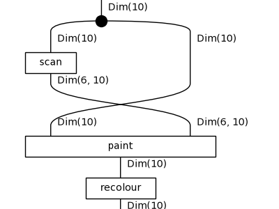
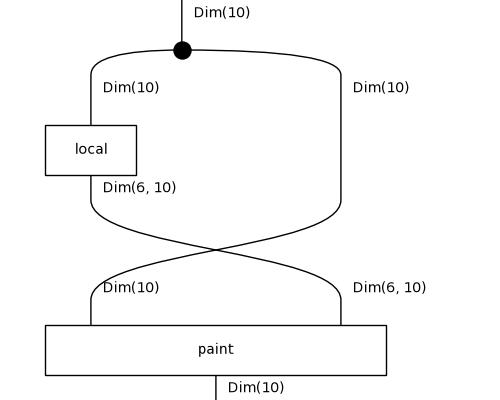
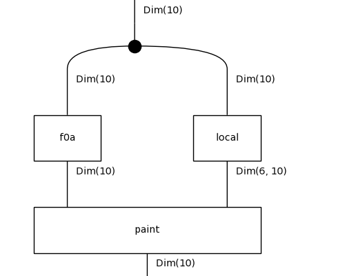
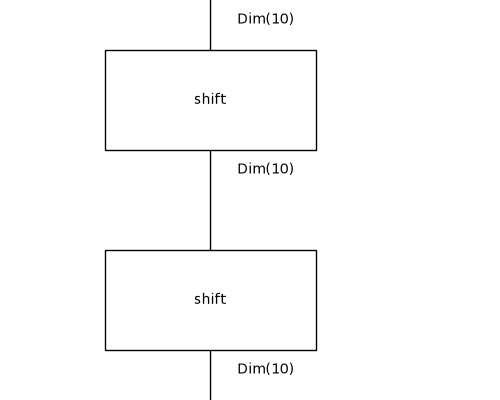
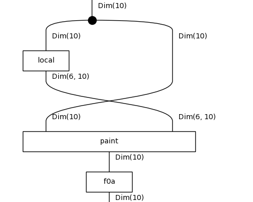

# Diagrammatic DreamCoder on 1D-ARC: results

Tasks: 180 (10 per family, drawn with seed 0), fitted on their 3 training pairs only, scored on the held-out test pair by exact match. Config: `/results/pr-cpu16/config.json`.

## Per iteration

| iteration | top-1 test | top-3 test | train fit exactly | mean DL (bits) | library | candidates | wall-clock |
|---|---|---|---|---|---|---|---|
| 0 | 79/180 (44%) | 120/180 | 93/180 | 84.2 | 7 | 57 | 141s |
| 1 | 101/180 (56%) | 136/180 | 111/180 | 76.6 | 9 | 80 | 324s |
| 2 | 103/180 (57%) | 138/180 | 114/180 | 77.4 | 11 | 80 | 373s |

Top-1 is the prediction of the least-DL candidate; top-3 counts a hit among the three kept. Mean DL is over the best candidate of every task.

## Per family (top-1 test exact match)

| family | it 0 | it 1 | it 2 |
|---|---|---|---|
| denoising_1c | 6/10 | 8/10 | 9/10 |
| denoising_mc | 1/10 | 1/10 | 2/10 |
| fill | 1/10 | 7/10 | 8/10 |
| flip | 0/10 | 0/10 | 0/10 |
| hollow | 5/10 | 10/10 | 10/10 |
| mirror | 1/10 | 1/10 | 0/10 |
| move_1p | 9/10 | 9/10 | 9/10 |
| move_2p | 10/10 | 10/10 | 10/10 |
| move_2p_dp | 0/10 | 0/10 | 0/10 |
| move_3p | 10/10 | 10/10 | 10/10 |
| move_dp | 0/10 | 0/10 | 0/10 |
| padded_fill | 8/10 | 10/10 | 10/10 |
| pcopy_1c | 0/10 | 1/10 | 1/10 |
| pcopy_mc | 1/10 | 3/10 | 3/10 |
| recolor_cmp | 10/10 | 10/10 | 10/10 |
| recolor_cnt | 6/10 | 7/10 | 7/10 |
| recolor_oe | 6/10 | 9/10 | 9/10 |
| scale_dp | 5/10 | 5/10 | 5/10 |

## Library growth

- after iteration 0: `f0a : Grid -> Grid` := `recolour(paint(x, segment(x)))` (8 trained weight tensors inherited)
- after iteration 0: `f0b : Grid -> Grid` := `recolour(paint(x, scan(x)))` (8 trained weight tensors inherited)
- after iteration 1: `f1a : Grid -> Grid` := `paint(f0a(x), segment(x))` (13 trained weight tensors inherited)
- after iteration 1: `f1b : Grid -> Grid` := `paint(x, segment(x))` (5 trained weight tensors inherited)

`f0a`'s body:

`f0b`'s body:

`f1a`'s body:

`f1b`'s body:

## Examples from the last iteration

### Solved: `1d_denoising_1c_37`

`paint(x, local(x))`, DL 54.8 = 6.3 structure + 47.7 parameters + 0.8 data bits, fits its training pairs exactly.

| pair | input | output |
|---|---|---|
| train 0 | `.55555555555555..5....5....5.....` | `.55555555555555..................` |
| train 1 | `..8.888888888888...8..8...8....8.` | `....888888888888.................` |
| train 2 | `55555555555555....5...5...5......` | `55555555555555...................` |
| **test** | `3333333333333..3..3....3....3....` | `3333333333333....................` |
| predicted | | `3333333333333....................` |

### Solved: `1d_move_3p_18`

`shift(x)`, DL 54.4 = 4.4 structure + 43.0 parameters + 6.9 data bits, fits its training pairs exactly.

| pair | input | output |
|---|---|---|
| train 0 | `......7777777....` | `.........7777777.` |
| train 1 | `666666...........` | `...666666........` |
| train 2 | `5555555555555....` | `...5555555555555.` |
| **test** | `..........444....` | `.............444.` |
| predicted | | `.............444.` |

### Solved: `1d_recolor_oe_46`

`paint(f0a(x), local(x))`, DL 68.1 = 10.4 structure + 57.5 parameters + 0.2 data bits, fits its training pairs exactly.

| pair | input | output |
|---|---|---|
| train 0 | `...777..77...7777.` | `...333..99...9999.` |
| train 1 | `.777777.777.777...` | `.999999.333.333...` |
| train 2 | `...777..77.7777..7` | `...333..99.9999..3` |
| **test** | `..777777..777..7..` | `..999999..333..3..` |
| predicted | | `..999999..333..3..` |

### Failed: `1d_move_dp_5`

`shift(shift(x))`, DL 156.1 = 7.8 structure + 82.3 parameters + 66.0 data bits, does not fit its training pairs exactly.

| pair | input | output |
|---|---|---|
| train 0 | `.........222222222....8..` | `.............2222222228..` |
| train 1 | `.......33333333333......8` | `.............333333333338` |
| train 2 | `.........444444.......8..` | `................4444448..` |
| **test** | `...........222...8.......` | `..............2228.......` |
| predicted | | `.................22......` |

### Failed: `1d_pcopy_mc_49`

`paint(f0b(x), local(x))`, DL 57.2 = 10.4 structure + 46.4 parameters + 0.4 data bits, fits its training pairs exactly.

| pair | input | output |
|---|---|---|
| train 0 | `..222....8...5....4..............` | `..222...888.555..444.............` |
| train 1 | `.111..5..........................` | `.111.555.........................` |
| train 2 | `..333..6....1....................` | `..333.666..111...................` |
| **test** | `.777....7........................` | `.777...777.......................` |
| predicted | | `.777737777.......................` |

### Failed: `1d_recolor_cnt_38`

`f0a(paint(x, local(x)))`, DL 92.4 = 10.4 structure + 64.4 parameters + 17.7 data bits, does not fit its training pairs exactly.

| pair | input | output |
|---|---|---|
| train 0 | `...33..3..333..33..3......` | `...11..9..666..11..9......` |
| train 1 | `.33..3...333...333...33...` | `.11..9...666...666...11...` |
| train 2 | `..333...3..33..333..333...` | `..666...9..11..666..666...` |
| **test** | `.3..33..333...333.3.......` | `.9..11..666...666.9.......` |
| predicted | | `.1..11..666...666.1.......` |

## All best solutions, last iteration

| task | term | DL | test |
|---|---|---|---|
| 1d_denoising_1c_16 | `f1b(shift(x))` | 57.7 | ✓ |
| 1d_denoising_1c_22 | `paint(x, local(x))` | 55.1 | ✓ |
| 1d_denoising_1c_25 | `shift(x)` | 71.0 | ✓ |
| 1d_denoising_1c_27 | `f0b(f0a(x))` | 36.9 | ✓ |
| 1d_denoising_1c_31 | `paint(x, local(x))` | 54.2 | ✓ |
| 1d_denoising_1c_37 | `paint(x, local(x))` | 54.8 | ✓ |
| 1d_denoising_1c_39 | `paint(x, local(x))` | 55.2 | ✓ |
| 1d_denoising_1c_44 | `shift(x)` | 70.5 | ✗ |
| 1d_denoising_1c_48 | `paint(shift(x), local(x))` | 71.2 | ✓ |
| 1d_denoising_1c_49 | `f0b(f0a(x))` | 62.7 | ✓ |
| 1d_denoising_mc_0 | `shift(x)` | 58.7 | ✗ |
| 1d_denoising_mc_11 | `shift(x)` | 61.5 | ✗ |
| 1d_denoising_mc_15 | `paint(shift(x), local(x))` | 60.7 | ✓ |
| 1d_denoising_mc_21 | `shift(x)` | 61.2 | ✗ |
| 1d_denoising_mc_25 | `shift(x)` | 62.6 | ✗ |
| 1d_denoising_mc_30 | `shift(x)` | 65.1 | ✗ |
| 1d_denoising_mc_36 | `f1b(shift(x))` | 69.4 | ✓ |
| 1d_denoising_mc_44 | `shift(x)` | 59.0 | ✗ |
| 1d_denoising_mc_5 | `shift(x)` | 58.1 | ✗ |
| 1d_denoising_mc_6 | `shift(x)` | 55.2 | ✗ |
| 1d_fill_10 | `f0b(recolour(x))` | 43.0 | ✓ |
| 1d_fill_14 | `f1b(f0b(x))` | 63.6 | ✓ |
| 1d_fill_19 | `shift(x)` | 68.4 | ✗ |
| 1d_fill_28 | `shift(x)` | 63.1 | ✗ |
| 1d_fill_30 | `f0b(paint(x, scan(x)))` | 34.2 | ✓ |
| 1d_fill_32 | `f0b(recolour(x))` | 46.5 | ✓ |
| 1d_fill_42 | `f0b(recolour(x))` | 49.9 | ✓ |
| 1d_fill_46 | `f1b(f0b(x))` | 72.6 | ✓ |
| 1d_fill_49 | `f0b(paint(x, scan(x)))` | 52.8 | ✓ |
| 1d_fill_9 | `f0b(paint(x, scan(x)))` | 62.1 | ✓ |
| 1d_flip_1 | `paint(shift(x), local(x))` | 112.0 | ✗ |
| 1d_flip_12 | `paint(shift(x), scan(x))` | 129.5 | ✗ |
| 1d_flip_13 | `paint(recolour(x), scan(x))` | 108.5 | ✗ |
| 1d_flip_2 | `paint(shift(x), local(x))` | 90.2 | ✗ |
| 1d_flip_27 | `paint(shift(x), scan(x))` | 105.4 | ✗ |
| 1d_flip_28 | `paint(x, segment(x))` | 120.2 | ✗ |
| 1d_flip_36 | `f0b(paint(x, local(x)))` | 102.3 | ✗ |
| 1d_flip_38 | `paint(shift(x), scan(x))` | 123.3 | ✗ |
| 1d_flip_40 | `shift(x)` | 120.5 | ✗ |
| 1d_flip_42 | `paint(shift(x), scan(x))` | 109.5 | ✗ |
| 1d_hollow_0 | `f1b(f0a(x))` | 63.9 | ✓ |
| 1d_hollow_10 | `recolour(f0a(x))` | 31.2 | ✓ |
| 1d_hollow_17 | `paint(f0a(x), segment(x))` | 43.2 | ✓ |
| 1d_hollow_23 | `f1a(x)` | 47.7 | ✓ |
| 1d_hollow_24 | `paint(f0a(x), segment(x))` | 48.9 | ✓ |
| 1d_hollow_30 | `recolour(f0a(x))` | 30.1 | ✓ |
| 1d_hollow_33 | `f1a(x)` | 47.3 | ✓ |
| 1d_hollow_39 | `f1a(x)` | 39.2 | ✓ |
| 1d_hollow_40 | `paint(f0a(x), scan(x))` | 39.9 | ✓ |
| 1d_hollow_43 | `f1a(x)` | 54.1 | ✓ |
| 1d_mirror_1 | `shift(paint(x, segment(x)))` | 164.8 | ✗ |
| 1d_mirror_13 | `paint(x, segment(x))` | 183.9 | ✗ |
| 1d_mirror_14 | `f1b(recolour(x))` | 148.1 | ✗ |
| 1d_mirror_23 | `f1b(recolour(x))` | 148.3 | ✗ |
| 1d_mirror_27 | `paint(x, scan(shift(x)))` | 181.8 | ✗ |
| 1d_mirror_28 | `paint(shift(x), scan(x))` | 186.5 | ✗ |
| 1d_mirror_37 | `paint(x, local(shift(x)))` | 121.1 | ✗ |
| 1d_mirror_42 | `paint(recolour(x), segment(x))` | 180.3 | ✗ |
| 1d_mirror_45 | `paint(x, local(shift(x)))` | 122.3 | ✗ |
| 1d_mirror_47 | `f1a(f0a(x))` | 176.7 | ✗ |
| 1d_move_1p_10 | `shift(x)` | 52.9 | ✓ |
| 1d_move_1p_12 | `shift(x)` | 53.4 | ✓ |
| 1d_move_1p_16 | `shift(x)` | 53.6 | ✓ |
| 1d_move_1p_18 | `paint(shift(x), local(x))` | 52.4 | ✗ |
| 1d_move_1p_19 | `shift(x)` | 55.2 | ✓ |
| 1d_move_1p_3 | `shift(x)` | 52.8 | ✓ |
| 1d_move_1p_35 | `shift(x)` | 52.5 | ✓ |
| 1d_move_1p_36 | `shift(x)` | 54.8 | ✓ |
| 1d_move_1p_49 | `shift(x)` | 52.8 | ✓ |
| 1d_move_1p_8 | `shift(x)` | 55.2 | ✓ |
| 1d_move_2p_16 | `shift(x)` | 47.9 | ✓ |
| 1d_move_2p_25 | `shift(x)` | 48.6 | ✓ |
| 1d_move_2p_32 | `shift(x)` | 48.5 | ✓ |
| 1d_move_2p_36 | `shift(x)` | 48.4 | ✓ |
| 1d_move_2p_40 | `shift(x)` | 49.1 | ✓ |
| 1d_move_2p_41 | `shift(x)` | 48.0 | ✓ |
| 1d_move_2p_44 | `shift(x)` | 54.5 | ✓ |
| 1d_move_2p_45 | `shift(x)` | 48.3 | ✓ |
| 1d_move_2p_47 | `shift(x)` | 48.0 | ✓ |
| 1d_move_2p_5 | `shift(x)` | 46.3 | ✓ |
| 1d_move_2p_dp_1 | `shift(x)` | 68.8 | ✗ |
| 1d_move_2p_dp_11 | `shift(x)` | 70.3 | ✗ |
| 1d_move_2p_dp_18 | `shift(x)` | 66.8 | ✗ |
| 1d_move_2p_dp_21 | `shift(x)` | 67.3 | ✗ |
| 1d_move_2p_dp_30 | `shift(x)` | 65.7 | ✗ |
| 1d_move_2p_dp_38 | `shift(x)` | 66.7 | ✗ |
| 1d_move_2p_dp_42 | `shift(x)` | 68.5 | ✗ |
| 1d_move_2p_dp_47 | `shift(x)` | 67.4 | ✗ |
| 1d_move_2p_dp_48 | `shift(x)` | 70.3 | ✗ |
| 1d_move_2p_dp_7 | `shift(x)` | 59.8 | ✗ |
| 1d_move_3p_17 | `shift(x)` | 54.0 | ✓ |
| 1d_move_3p_18 | `shift(x)` | 54.4 | ✓ |
| 1d_move_3p_2 | `shift(x)` | 54.7 | ✓ |
| 1d_move_3p_31 | `shift(x)` | 54.3 | ✓ |
| 1d_move_3p_32 | `shift(x)` | 53.8 | ✓ |
| 1d_move_3p_33 | `shift(x)` | 54.0 | ✓ |
| 1d_move_3p_34 | `shift(x)` | 53.2 | ✓ |
| 1d_move_3p_37 | `shift(x)` | 53.2 | ✓ |
| 1d_move_3p_42 | `shift(x)` | 54.0 | ✓ |
| 1d_move_3p_9 | `shift(x)` | 54.8 | ✓ |
| 1d_move_dp_1 | `shift(shift(x))` | 128.4 | ✗ |
| 1d_move_dp_13 | `recolour(paint(x, local(x)))` | 149.4 | ✗ |
| 1d_move_dp_18 | `shift(x)` | 105.8 | ✗ |
| 1d_move_dp_2 | `paint(f0a(x), scan(x))` | 191.4 | ✗ |
| 1d_move_dp_28 | `shift(shift(x))` | 137.6 | ✗ |
| 1d_move_dp_38 | `f1b(f0a(x))` | 154.1 | ✗ |
| 1d_move_dp_44 | `shift(x)` | 62.6 | ✗ |
| 1d_move_dp_49 | `shift(paint(x, scan(x)))` | 194.2 | ✗ |
| 1d_move_dp_5 | `shift(shift(x))` | 156.1 | ✗ |
| 1d_move_dp_8 | `shift(x)` | 63.7 | ✗ |
| 1d_padded_fill_18 | `f1b(f0b(x))` | 47.7 | ✓ |
| 1d_padded_fill_22 | `f1b(f0b(x))` | 56.8 | ✓ |
| 1d_padded_fill_23 | `paint(f0b(x), segment(x))` | 60.3 | ✓ |
| 1d_padded_fill_27 | `f0b(paint(x, scan(x)))` | 60.0 | ✓ |
| 1d_padded_fill_32 | `paint(f0b(x), segment(x))` | 60.3 | ✓ |
| 1d_padded_fill_40 | `f1b(f0b(x))` | 48.9 | ✓ |
| 1d_padded_fill_42 | `paint(f0b(x), segment(x))` | 51.1 | ✓ |
| 1d_padded_fill_6 | `f1b(f0b(x))` | 49.8 | ✓ |
| 1d_padded_fill_8 | `paint(f0b(x), segment(x))` | 49.2 | ✓ |
| 1d_padded_fill_9 | `f1b(f0b(x))` | 49.9 | ✓ |
| 1d_pcopy_1c_0 | `shift(x)` | 86.0 | ✗ |
| 1d_pcopy_1c_18 | `paint(f0a(x), local(x))` | 88.5 | ✓ |
| 1d_pcopy_1c_2 | `shift(x)` | 102.6 | ✗ |
| 1d_pcopy_1c_21 | `shift(x)` | 92.7 | ✗ |
| 1d_pcopy_1c_22 | `shift(x)` | 93.2 | ✗ |
| 1d_pcopy_1c_24 | `shift(x)` | 92.0 | ✗ |
| 1d_pcopy_1c_32 | `shift(x)` | 92.5 | ✗ |
| 1d_pcopy_1c_36 | `shift(x)` | 98.4 | ✗ |
| 1d_pcopy_1c_4 | `shift(x)` | 91.6 | ✗ |
| 1d_pcopy_1c_49 | `shift(x)` | 92.1 | ✗ |
| 1d_pcopy_mc_12 | `paint(f0b(x), local(x))` | 49.6 | ✓ |
| 1d_pcopy_mc_21 | `paint(shift(x), local(x))` | 82.8 | ✓ |
| 1d_pcopy_mc_24 | `shift(x)` | 87.1 | ✗ |
| 1d_pcopy_mc_26 | `paint(f0b(x), local(x))` | 52.9 | ✓ |
| 1d_pcopy_mc_27 | `shift(x)` | 75.9 | ✗ |
| 1d_pcopy_mc_30 | `paint(f0b(x), local(x))` | 85.1 | ✗ |
| 1d_pcopy_mc_32 | `shift(x)` | 87.3 | ✗ |
| 1d_pcopy_mc_33 | `shift(x)` | 93.6 | ✗ |
| 1d_pcopy_mc_36 | `shift(x)` | 76.0 | ✗ |
| 1d_pcopy_mc_49 | `paint(f0b(x), local(x))` | 57.2 | ✗ |
| 1d_recolor_cmp_10 | `recolour(paint(x, segment(x)))` | 69.7 | ✓ |
| 1d_recolor_cmp_11 | `paint(f0a(x), local(x))` | 31.4 | ✓ |
| 1d_recolor_cmp_18 | `paint(f0a(x), scan(x))` | 45.5 | ✓ |
| 1d_recolor_cmp_3 | `f1a(x)` | 60.0 | ✓ |
| 1d_recolor_cmp_34 | `recolour(paint(x, segment(x)))` | 53.7 | ✓ |
| 1d_recolor_cmp_36 | `recolour(paint(x, segment(x)))` | 67.6 | ✓ |
| 1d_recolor_cmp_39 | `recolour(paint(x, segment(x)))` | 67.6 | ✓ |
| 1d_recolor_cmp_46 | `paint(f0a(x), segment(x))` | 32.5 | ✓ |
| 1d_recolor_cmp_8 | `recolour(paint(x, segment(x)))` | 54.6 | ✓ |
| 1d_recolor_cmp_9 | `recolour(paint(x, segment(x)))` | 54.8 | ✓ |
| 1d_recolor_cnt_1 | `f1a(x)` | 120.4 | ✓ |
| 1d_recolor_cnt_15 | `recolour(paint(x, scan(x)))` | 116.1 | ✗ |
| 1d_recolor_cnt_21 | `paint(shift(x), segment(x))` | 105.2 | ✓ |
| 1d_recolor_cnt_28 | `paint(f0a(x), local(x))` | 112.0 | ✓ |
| 1d_recolor_cnt_38 | `f0a(paint(x, local(x)))` | 92.4 | ✗ |
| 1d_recolor_cnt_4 | `f0a(paint(x, segment(x)))` | 98.7 | ✓ |
| 1d_recolor_cnt_45 | `paint(f0a(x), scan(x))` | 106.7 | ✗ |
| 1d_recolor_cnt_46 | `paint(f1b(x), segment(x))` | 128.9 | ✓ |
| 1d_recolor_cnt_48 | `f0a(paint(x, segment(x)))` | 98.7 | ✓ |
| 1d_recolor_cnt_9 | `f0a(paint(x, segment(x)))` | 104.1 | ✓ |
| 1d_recolor_oe_12 | `paint(f0a(x), segment(x))` | 86.7 | ✓ |
| 1d_recolor_oe_14 | `paint(f1b(x), segment(x))` | 109.0 | ✓ |
| 1d_recolor_oe_17 | `paint(recolour(x), segment(x))` | 98.3 | ✓ |
| 1d_recolor_oe_19 | `paint(x, scan(x))` | 97.1 | ✗ |
| 1d_recolor_oe_25 | `paint(f1b(x), segment(x))` | 95.8 | ✓ |
| 1d_recolor_oe_27 | `paint(x, segment(f0b(x)))` | 73.8 | ✓ |
| 1d_recolor_oe_32 | `recolour(paint(x, segment(x)))` | 81.0 | ✓ |
| 1d_recolor_oe_35 | `recolour(paint(x, segment(x)))` | 78.6 | ✓ |
| 1d_recolor_oe_43 | `paint(x, segment(f0b(x)))` | 69.3 | ✓ |
| 1d_recolor_oe_46 | `paint(f0a(x), local(x))` | 68.1 | ✓ |
| 1d_scale_dp_10 | `paint(x, local(shift(x)))` | 105.6 | ✗ |
| 1d_scale_dp_15 | `recolour(paint(x, scan(x)))` | 57.5 | ✓ |
| 1d_scale_dp_20 | `recolour(paint(x, local(x)))` | 48.4 | ✗ |
| 1d_scale_dp_24 | `recolour(paint(x, local(x)))` | 61.9 | ✓ |
| 1d_scale_dp_27 | `recolour(paint(x, scan(x)))` | 83.5 | ✓ |
| 1d_scale_dp_3 | `paint(shift(x), scan(x))` | 88.2 | ✓ |
| 1d_scale_dp_34 | `recolour(paint(x, local(x)))` | 63.5 | ✗ |
| 1d_scale_dp_36 | `shift(x)` | 66.6 | ✗ |
| 1d_scale_dp_49 | `recolour(paint(x, scan(x)))` | 57.7 | ✓ |
| 1d_scale_dp_5 | `paint(x, local(shift(x)))` | 92.9 | ✗ |
